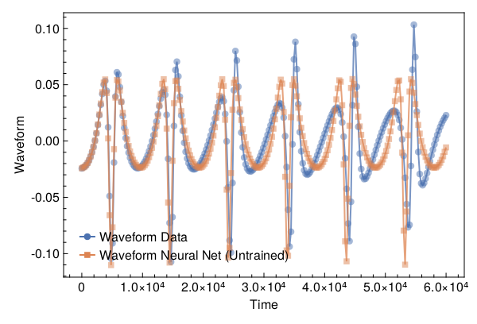
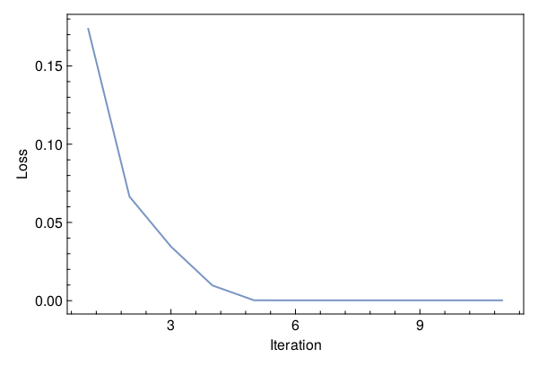
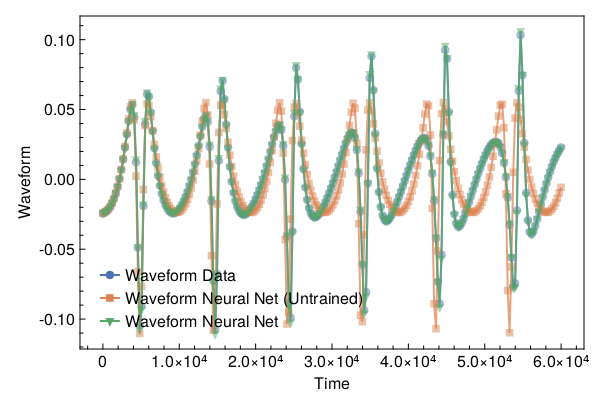

<a id='Training-a-Neural-ODE-to-Model-Gravitational-Waveforms'></a>

# Training a Neural ODE to Model Gravitational Waveforms


This code is adapted from [Astroinformatics/ScientificMachineLearning](https://github.com/Astroinformatics/ScientificMachineLearning/blob/c93aac3a460d70b4cce98836b677fd9b732e94b7/neuralode_gw.ipynb)


The code has been minimally adapted from [Keith et. al. 2021](https://arxiv.org/abs/2102.12695) which originally used Flux.jl


<a id='Package-Imports'></a>

## Package Imports


```julia
using Lux, ComponentArrays, LineSearches, LuxAMDGPU, LuxCUDA, OrdinaryDiffEq,
    Optimization, OptimizationOptimJL, Random, SciMLSensitivity
using CairoMakie, MakiePublication
CUDA.allowscalar(false)
```


<a id='Define-some-Utility-Functions'></a>

## Define some Utility Functions


::: tip


This section can be skipped. It defines functions to simulate the model, however, from a scientific machine learning perspective, isn't super relevant.


:::


We need a very crude 2-body path. Assume the 1-body motion is a newtonian 2-body position vector $r = r_1 - r_2$ and use Newtonian formulas to get $r_1$, $r_2$ (e.g. Theoretical Mechanics of Particles and Continua 4.3)


```julia
function one2two(path, m₁, m₂)
    M = m₁ + m₂
    r₁ = m₂ / M .* path
    r₂ = -m₁ / M .* path
    return r₁, r₂
end
```


```
one2two (generic function with 1 method)
```


Next we define a function to perform the change of variables: $(\chi(t),\phi(t)) \mapsto (x(t),y(t))$


```julia
@views function soln2orbit(soln, model_params=nothing)
    @assert size(soln, 1) ∈ [2, 4] "size(soln,1) must be either 2 or 4"

    if size(soln, 1) == 2
        χ = soln[1, :]
        ϕ = soln[2, :]

        @assert length(model_params)==3 "model_params must have length 3 when size(soln,2) = 2"
        p, M, e = model_params
    else
        χ = soln[1, :]
        ϕ = soln[2, :]
        p = soln[3, :]
        e = soln[4, :]
    end

    r = p ./ (1 .+ e .* cos.(χ))
    x = r .* cos.(ϕ)
    y = r .* sin.(ϕ)

    orbit = vcat(x', y')
    return orbit
end
```


```
soln2orbit (generic function with 2 methods)
```


This function uses second-order one-sided difference stencils at the endpoints; see https://doi.org/10.1090/S0025-5718-1988-0935077-0


```julia
function d_dt(v::AbstractVector, dt)
    a = -3 / 2 * v[1] + 2 * v[2] - 1 / 2 * v[3]
    b = (v[3:end] .- v[1:(end - 2)]) / 2
    c = 3 / 2 * v[end] - 2 * v[end - 1] + 1 / 2 * v[end - 2]
    return [a; b; c] / dt
end
```


```
d_dt (generic function with 1 method)
```


This function uses second-order one-sided difference stencils at the endpoints; see https://doi.org/10.1090/S0025-5718-1988-0935077-0


```julia
function d2_dt2(v::AbstractVector, dt)
    a = 2 * v[1] - 5 * v[2] + 4 * v[3] - v[4]
    b = v[1:(end - 2)] .- 2 * v[2:(end - 1)] .+ v[3:end]
    c = 2 * v[end] - 5 * v[end - 1] + 4 * v[end - 2] - v[end - 3]
    return [a; b; c] / (dt^2)
end
```


```
d2_dt2 (generic function with 1 method)
```


Now we define a function to compute the trace-free moment tensor from the orbit


```julia
function orbit2tensor(orbit, component, mass=1)
    x = orbit[1, :]
    y = orbit[2, :]

    Ixx = x .^ 2
    Iyy = y .^ 2
    Ixy = x .* y
    trace = Ixx .+ Iyy

    if component[1] == 1 && component[2] == 1
        tmp = Ixx .- trace ./ 3
    elseif component[1] == 2 && component[2] == 2
        tmp = Iyy .- trace ./ 3
    else
        tmp = Ixy
    end

    return mass .* tmp
end

function h_22_quadrupole_components(dt, orbit, component, mass=1)
    mtensor = orbit2tensor(orbit, component, mass)
    mtensor_ddot = d2_dt2(mtensor, dt)
    return 2 * mtensor_ddot
end

function h_22_quadrupole(dt, orbit, mass=1)
    h11 = h_22_quadrupole_components(dt, orbit, (1, 1), mass)
    h22 = h_22_quadrupole_components(dt, orbit, (2, 2), mass)
    h12 = h_22_quadrupole_components(dt, orbit, (1, 2), mass)
    return h11, h12, h22
end

function h_22_strain_one_body(dt::T, orbit) where {T}
    h11, h12, h22 = h_22_quadrupole(dt, orbit)

    h₊ = h11 - h22
    hₓ = T(2) * h12

    scaling_const = √(T(π) / 5)
    return scaling_const * h₊, -scaling_const * hₓ
end

function h_22_quadrupole_two_body(dt, orbit1, mass1, orbit2, mass2)
    h11_1, h12_1, h22_1 = h_22_quadrupole(dt, orbit1, mass1)
    h11_2, h12_2, h22_2 = h_22_quadrupole(dt, orbit2, mass2)
    h11 = h11_1 + h11_2
    h12 = h12_1 + h12_2
    h22 = h22_1 + h22_2
    return h11, h12, h22
end

function h_22_strain_two_body(dt::T, orbit1, mass1, orbit2, mass2) where {T}
    # compute (2,2) mode strain from orbits of BH 1 of mass1 and BH2 of mass 2

    @assert abs(mass1 + mass2 - 1.0)<1e-12 "Masses do not sum to unity"

    h11, h12, h22 = h_22_quadrupole_two_body(dt, orbit1, mass1, orbit2, mass2)

    h₊ = h11 - h22
    hₓ = T(2) * h12

    scaling_const = √(T(π) / 5)
    return scaling_const * h₊, -scaling_const * hₓ
end

function compute_waveform(dt::T, soln, mass_ratio, model_params=nothing) where {T}
    @assert mass_ratio≤1 "mass_ratio must be <= 1"
    @assert mass_ratio≥0 "mass_ratio must be non-negative"

    orbit = soln2orbit(soln, model_params)
    if mass_ratio > 0
        m₂ = inv(T(1) + mass_ratio)
        m₁ = mass_ratio * m₂

        orbit₁, orbit₂ = one2two(orbit, m₁, m₂)
        waveform = h_22_strain_two_body(dt, orbit1, mass1, orbit2, mass2)
    else
        waveform = h_22_strain_one_body(dt, orbit)
    end
    return waveform
end
```


```
compute_waveform (generic function with 2 methods)
```


<a id='Simulating-the-True-Model'></a>

## Simulating the True Model


`RelativisticOrbitModel` defines system of odes which describes motion of point like particle in schwarzschild background, uses


$$
u[1] = \chi
$$


$$
u[2] = \phi
$$


where, $p$, $M$, and $e$ are constants


```julia
function RelativisticOrbitModel(u, (p, M, e), t)
    χ, ϕ = u

    numer = (p - 2 - 2 * e * cos(χ)) * (1 + e * cos(χ))^2
    denom = sqrt((p - 2)^2 - 4 * e^2)

    χ̇ = numer * sqrt(p - 6 - 2 * e * cos(χ)) / (M * (p^2) * denom)
    ϕ̇ = numer / (M * (p^(3 / 2)) * denom)

    return [χ̇, ϕ̇]
end

mass_ratio = 0.0         # test particle
u0 = Float64[π, 0.0]     # initial conditions
datasize = 250
tspan = (0.0f0, 6.0f4)   # timespace for GW waveform
tsteps = range(tspan[1], tspan[2]; length=datasize)  # time at each timestep
dt_data = tsteps[2] - tsteps[1]
dt = 100.0
const ode_model_params = [100.0, 1.0, 0.5]; # p, M, e
```


Let's simulate the true model and plot the results using `OrdinaryDiffEq.jl`


```julia
prob = ODEProblem(RelativisticOrbitModel, u0, tspan, ode_model_params)
soln = Array(solve(prob, RK4(); saveat=tsteps, dt, adaptive=false))
waveform = first(compute_waveform(dt_data, soln, mass_ratio, ode_model_params))

fig = with_theme(theme_web()) do
    fig = Figure()
    ax = CairoMakie.Axis(fig[1, 1]; xlabel="Time", ylabel="Waveform")

    l = lines!(ax, tsteps, waveform; linewidth=2, alpha=0.75)
    s = scatter!(ax, tsteps, waveform; markershape=:circle, markeralpha=0.25, alpha=0.5)

    axislegend(ax, [[l, s]], ["Waveform Data"])

    return fig
end
```


<a id='Defiing-a-Neural-Network-Model'></a>

## Defiing a Neural Network Model


Next, we define the neural network model that takes 1 input (time) and has two outputs. We'll make a function `ODE_model` that takes the initial conditions, neural network parameters and a time as inputs and returns the derivatives.


It is typically never recommended to use globals but incase you do use them, make sure to mark them as `const`.


We will deviate from the standard Neural Network initialization and use `WeightInitializers.jl`,


```julia
const nn = Chain(Base.Fix1(broadcast, cos),
    Dense(1 => 32, cos; init_weight=truncated_normal(; std=1e-4)),
    Dense(32 => 32, cos; init_weight=truncated_normal(; std=1e-4)),
    Dense(32 => 2; init_weight=truncated_normal(; std=1e-4)))
ps, st = Lux.setup(MersenneTwister(), nn)
```


```
((layer_1 = NamedTuple(), layer_2 = (weight = Float32[7.92629f-5; 8.963758f-5; 3.493073f-5; 4.4153083f-5; -0.0002107005; 1.999306f-5; 0.00015261762; -5.52497f-5; 2.125516f-5; 9.937067f-5; -0.0001704387; 6.112199f-5; -4.177446f-5; -3.268809f-5; 0.00016859127; 0.00013255193; -3.938751f-6; 2.4322107f-5; 1.3347792f-6; 8.582085f-5; -4.713503f-5; 5.1400253f-5; -8.509217f-5; -0.00013582877; -2.759806f-5; 0.00027111257; -1.3800029f-5; 3.665641f-5; 3.912584f-5; 5.8479007f-5; 4.256178f-6; -0.00014047313;;], bias = Float32[0.0; 0.0; 0.0; 0.0; 0.0; 0.0; 0.0; 0.0; 0.0; 0.0; 0.0; 0.0; 0.0; 0.0; 0.0; 0.0; 0.0; 0.0; 0.0; 0.0; 0.0; 0.0; 0.0; 0.0; 0.0; 0.0; 0.0; 0.0; 0.0; 0.0; 0.0; 0.0;;]), layer_3 = (weight = Float32[7.9823214f-5 -0.00012206136 -0.00018114623 0.00018942055 1.63708f-5 4.425074f-5 3.8621558f-5 9.595141f-5 -5.7037447f-5 -3.4850486f-6 -4.174867f-5 0.0001184534 -0.000109529385 -5.0177452f-5 7.0496026f-5 6.841869f-5 0.00012498275 0.0001413718 -9.3042574f-5 -0.00013341312 -1.4996814f-5 6.874323f-6 0.00010907411 2.1220625f-5 -2.077451f-5 0.00015291398 0.00012371804 -0.00019755786 -3.810865f-5 -0.00011133348 1.3421287f-5 -3.2233733f-5; -2.4183597f-5 0.00010337306 5.7765996f-5 -4.3278673f-5 -6.0367267f-5 -2.0968893f-5 -0.00010095071 -7.8907775f-5 -0.00019798602 1.7017113f-5 3.6821395f-5 -0.00018444467 -8.779071f-5 -0.0001359151 -0.00018633166 9.076598f-5 -6.8342546f-5 0.00017291756 -3.0758823f-5 -3.6370697f-5 -9.174917f-5 -0.00015055477 -0.00012091129 -1.5757178f-5 0.000108646695 0.00012295297 0.00024656398 4.049397f-5 6.518373f-5 6.184674f-5 -8.551007f-5 3.2398042f-5; 0.00011342714 -4.1287723f-5 0.00014379439 8.204721f-5 -0.00010709459 -0.00018048519 3.2444026f-5 -4.8906906f-5 -5.491859f-5 4.2891974f-5 3.2421536f-5 0.0002147038 -7.262392f-5 9.992134f-5 -0.00012331853 0.00011338257 -6.108234f-5 -4.008625f-5 5.892991f-6 0.00017999356 0.00011223425 5.9931503f-5 -6.513027f-5 5.7411027f-5 2.0824404f-5 -2.3247265f-5 2.0567875f-5 -3.3813627f-5 9.195073f-5 -0.00017511682 3.1892294f-5 0.00015152372; -1.6679598f-5 0.00014941036 -0.00023014938 5.352161f-5 4.260458f-5 -0.000106489875 -0.00011431337 2.858143f-5 -0.00015886953 -0.00017726092 6.665226f-5 8.5340325f-5 8.2567036f-5 9.076485f-5 -1.640051f-6 -7.308381f-5 -0.00010346921 -8.71185f-5 0.00014529604 4.3995322f-5 -3.1368872f-5 -0.00016669933 -8.414861f-5 0.000112703434 1.2087476f-5 6.7314366f-5 0.00013433344 5.1697265f-5 1.5231991f-5 6.836599f-5 0.00010443612 9.8467775f-5; -7.570643f-5 -3.6716498f-5 -3.0930394f-5 3.3007662f-5 -3.268522f-5 3.9630377f-5 -2.5793224f-5 0.00016213601 -8.827673f-5 -0.00015114686 -8.636201f-5 1.4620598f-5 0.00016339871 0.00018316698 -9.442351f-6 0.0001042904 -3.447846f-5 1.1450611f-5 -5.4113756f-5 1.7566947f-6 3.2926816f-6 5.5414315f-5 6.22476f-5 8.186786f-5 3.6306057f-5 2.865963f-5 -0.00015814799 -9.417617f-5 5.8987247f-5 0.000100999765 -3.174798f-6 -9.137401f-5; -7.413853f-5 -2.9412522f-5 -7.814026f-6 8.108225f-5 3.509088f-5 -0.00011449844 9.234789f-6 -0.000121603305 -1.938057f-5 -7.199346f-5 2.686532f-5 -2.7513295f-5 5.0599698f-5 -0.00013159795 3.38559f-5 0.00019148325 -3.007416f-5 4.173602f-6 0.00011461748 0.0001096579 5.351761f-6 9.634314f-6 -2.070255f-5 1.5087327f-5 -0.00012314657 -6.639188f-5 -9.303383f-5 7.4250245f-5 0.00018579111 -0.000102554135 -1.5963033f-5 -1.4914864f-5; -5.804815f-5 2.3193483f-5 5.7414025f-5 -1.005976f-5 -6.0259455f-5 3.879676f-5 4.478115f-5 0.00012424863 -2.6242224f-5 -0.00010742273 2.1326656f-5 -0.000102512735 -9.362107f-5 0.00017216282 1.8353414f-5 -0.000112935515 0.000110264045 -0.00014638648 -3.783503f-5 6.340113f-5 3.0416297f-5 -0.00010881474 -6.050626f-5 0.00016769739 3.2196156f-5 0.00019707369 0.00012085706 -7.0225033f-6 4.5473174f-5 -0.00022371262 -3.67734f-5 -7.1443974f-5; -0.0002336184 -9.40844f-5 -1.7427812f-5 -0.0002434784 4.8125927f-5 0.00011844978 -6.473573f-5 -6.680323f-5 -8.4517036f-5 -0.00011218069 -2.1955328f-5 0.00017485615 5.5273373f-5 3.9075974f-5 -1.2725464f-5 3.644707f-5 0.00015839392 2.3950748f-5 -0.00019737521 2.9325588f-7 0.00011207642 8.839971f-6 -6.8239206f-5 -3.60472f-5 9.926393f-6 9.014335f-6 6.394477f-5 0.00016873017 -6.695634f-5 5.5996636f-5 0.00020711287 -1.0185757f-5; -0.00014643246 9.0435344f-5 6.397259f-5 3.433633f-5 4.8003974f-5 -6.5012915f-5 -8.508651f-5 -1.4781656f-5 3.817125f-5 -0.00015363966 2.3116627f-5 -7.838366f-5 -4.1047795f-5 -2.4752215f-5 0.00017246322 -5.6491455f-5 6.810607f-7 -0.00011717208 5.3365777f-5 6.9494636f-5 8.752919f-5 -8.413068f-5 -0.00014392297 -8.422514f-5 5.586096f-5 -7.223273f-5 -2.4916963f-5 -4.594368f-5 -5.169793f-7 -6.378955f-5 5.950807f-5 0.0002111321; 0.00012109863 -0.00014645769 -3.3617085f-5 -4.652919f-5 -9.907535f-6 -5.799985f-5 1.7560467f-5 -0.0001889775 0.00013709177 5.3216958f-5 -1.4794949f-5 -3.77417f-5 -4.2434924f-5 -3.1934836f-5 2.0097847f-5 -3.681209f-5 8.560784f-5 2.7148735f-5 -0.0001637403 3.8307076f-5 -0.00019166767 2.3105853f-5 0.00010717612 7.6717544f-5 -0.00016670857 -0.0001291379 4.3733184f-5 0.00015184216 5.2289164f-5 6.30524f-5 -7.621076f-5 0.00011007157; -0.000117215015 2.6539868f-5 -0.000118476 8.053494f-5 0.00014251891 -8.090944f-6 8.8111185f-5 -4.09564f-5 -4.3510195f-6 4.841345f-5 -2.838753f-5 3.8509963f-5 1.09832035f-5 1.1687446f-5 -1.8954475f-5 0.00022711593 -6.975864f-6 9.4894705f-5 -0.000103494276 0.000102537095 1.3220624f-5 0.00015285688 -2.5848803f-5 -6.444484f-6 -5.5825374f-5 4.381234f-5 -7.015089f-5 -4.427315f-5 -0.00014588241 -0.0001772319 1.5179635f-5 -1.814128f-5; -3.8333317f-5 -1.7899578f-6 -6.19214f-5 5.5212877f-5 4.5087938f-5 4.1115454f-6 -3.261664f-5 -0.00024082356 8.171417f-5 -8.65299f-5 1.0354307f-5 0.00012067119 8.934049f-6 2.3715724f-5 -7.13208f-5 -9.882091f-5 3.9902647f-5 1.3671015f-5 1.5665059f-5 -1.2899391f-5 2.5140496f-5 0.00011401963 -0.00011498145 -0.0001049223 2.2349761f-5 -0.00019904776 0.00018642278 3.8047383f-5 -0.00023404567 -0.00012244348 8.974132f-5 -0.00012371335; 2.3286162f-5 6.318248f-5 5.3756445f-5 1.4066696f-5 -4.5150995f-5 -0.00013379288 0.00015370798 -9.571837f-5 -0.000117310214 6.458499f-5 -6.667275f-5 -3.995666f-5 5.8935298f-6 0.000110186265 -0.00010391527 4.3204458f-5 -9.423718f-5 0.00010577844 -1.1807198f-5 -9.284555f-5 -3.5693447f-5 1.8592991f-5 -8.68372f-5 -9.2638504f-5 -0.00017991828 -6.227981f-5 -0.00017175585 9.1182155f-5 -9.797834f-5 -0.00011620728 -2.6332234f-5 2.3850575f-5; 0.000109134744 8.2945626f-5 -9.118505f-5 5.3228803f-5 3.0383375f-5 -4.3886685f-5 -7.9936355f-5 4.08475f-5 5.8979815f-5 3.2169813f-5 -0.00018466878 -8.223429f-5 0.00013690769 6.900859f-5 -4.2566826f-5 -0.0001145828 3.3092176f-5 -7.7767094f-5 9.230006f-5 -2.9917176f-6 0.00011342356 6.688789f-5 -0.00017031534 -6.186005f-5 -5.4279946f-5 -0.00017457019 -3.1323394f-5 -9.739483f-5 3.2504315f-5 -0.00016769653 -4.091052f-5 0.00019330093; 2.6291136f-6 -6.0696337f-5 6.0748152f-6 -3.940099f-5 -6.2226165f-5 2.389211f-5 -9.2921764f-5 0.00024575402 -9.3857295f-8 9.561982f-5 2.604854f-5 0.00011305552 -5.4442196f-5 0.000116661 0.0002492224 -8.224689f-6 0.00012422522 3.3367724f-5 -5.504205f-5 6.8959074f-5 -0.00020304088 -6.605304f-5 -1.21600215f-5 2.0271187f-5 -0.00023165577 7.190645f-5 -0.00017766193 -3.9142746f-5 -7.927599f-5 -2.1320602f-5 -6.22328f-5 0.00010600107; 0.000108983535 8.405523f-5 0.0001486747 -9.694156f-5 0.00012676955 9.70121f-5 0.00012673512 -9.185756f-5 0.00019208288 7.993631f-5 -1.5280391f-5 -2.1975164f-5 0.00017343611 7.525943f-5 -0.00010570747 -5.1797462f-5 0.00015070112 -0.00013188204 -3.597247f-5 -0.00010354748 -8.286586f-5 3.3432686f-6 7.572283f-5 -3.113248f-5 0.00028895764 1.5824346f-5 3.6582725f-5 -2.3499322f-5 -0.00013605431 -3.337066f-5 -0.000109138105 -7.280546f-5; -7.824114f-5 6.815467f-5 4.525988f-5 0.00015762527 6.539352f-5 -2.9485798f-6 -0.00013757947 -2.3208553f-5 4.8806636f-5 3.913126f-5 -5.768308f-5 -0.00019494107 5.8256363f-5 -9.3172195f-5 -0.00019158765 2.4678706f-5 1.5310594f-5 -0.00015309846 2.2177981f-5 -0.00019072036 9.405891f-5 -7.018116f-5 0.00020488571 -5.498872f-5 -9.451265f-6 1.28808f-5 -2.3284812f-5 -7.776591f-6 3.854533f-5 -0.000248639 7.56139f-5 -8.696662f-5; -5.4756474f-5 2.4769932f-5 -0.00011740398 2.677159f-5 8.5959815f-5 3.419209f-5 2.9430184f-5 -0.000107019434 6.0084265f-5 -0.00020614998 1.2548443f-5 8.615424f-5 -0.00012177825 -5.3988924f-6 1.4417426f-5 -0.00011539292 -0.00016165867 9.779906f-5 4.9322334f-5 -5.04921f-5 9.861097f-5 -0.00011151147 0.0001263262 -8.765061f-5 -0.00017266771 1.6371012f-5 -3.123114f-5 -3.2561813f-5 7.6290776f-6 0.0002079505 -0.0002163636 0.00012839767; -7.659352f-5 -9.9572635f-6 0.00010486299 -8.950583f-5 2.4540044f-5 6.3519976f-5 -5.9201666f-5 -4.037934f-5 1.1340743f-5 -0.00020576203 -0.00013202764 -4.4222335f-5 0.00010765139 8.6727116f-5 -8.050957f-5 -3.3556166f-6 -4.7531765f-5 0.00019166242 5.5380835f-5 -6.38564f-5 -8.5284984f-5 0.00011997148 9.4746305f-5 0.00012749572 -9.1919665f-6 -8.124358f-5 -8.5144886f-5 6.896427f-5 6.944705f-5 -2.2589436f-5 4.3065047f-5 7.7749464f-5; 7.141177f-5 7.583651f-5 0.00021902805 -4.992212f-5 6.951324f-5 7.286246f-5 -1.9208721f-5 -7.9718964f-5 6.631067f-5 -7.678053f-5 -7.4602394f-5 -5.578529f-5 5.2001415f-6 -0.00014050248 4.9778897f-5 -3.428141f-5 4.557645f-6 -6.5435524f-5 -7.608202f-5 0.000113992675 -0.00015495555 6.909543f-5 2.3694118f-5 8.001424f-5 -0.00020567178 4.4853834f-5 -8.0126476f-5 -8.090115f-5 -7.3793395f-5 0.0002122721 -3.895148f-5 0.0001765369; 1.4395204f-5 -4.093713f-5 -0.00010874714 4.4061428f-5 3.065917f-6 5.9781665f-5 -8.435144f-5 0.00018880476 -7.403041f-5 0.00014744177 6.267131f-5 -1.4374311f-5 -8.0304344f-5 -8.8167064f-5 0.00017175559 -6.342853f-5 -9.106507f-5 0.0003099047 0.00015948857 0.00010092768 -5.950543f-5 0.00010292598 -1.1512153f-5 0.00013815002 2.4945537f-5 0.00010583006 0.00014227274 -4.4064294f-5 -4.0744035f-5 5.4950317f-5 -2.0479742f-5 1.3777343f-5; -0.00015091567 -6.309907f-5 -9.027664f-5 1.6748747f-5 0.00013249619 7.0304714f-6 0.00019792836 -7.840422f-5 0.00031013106 2.5377454f-5 7.591047f-5 9.456835f-5 -0.00010986693 6.8423375f-5 0.000113934446 -2.6232883f-5 -4.74555f-5 1.1605014f-5 -2.5048663f-5 -0.00015090495 -0.00018958739 8.398115f-5 -0.00010059333 -0.00017569361 4.249604f-5 5.0658527f-5 7.60754f-5 -0.00017431815 3.4815173f-5 1.5520298f-5 -7.807746f-5 -0.00018789261; -7.0190886f-6 8.145642f-5 -0.00022359529 6.5723405f-5 1.6138865f-5 -0.00010870478 -8.835868f-5 3.934481f-5 -8.313507f-5 0.0002089303 -9.795618f-5 1.3774266f-5 -0.00012136269 -0.00013180515 0.00014541748 0.00012589316 -0.00011188646 0.00019518822 4.3961714f-5 4.7292797f-5 -4.456499f-5 -9.5988f-6 6.703492f-5 -0.000102492726 5.1504736f-5 -5.2193984f-5 -0.00013522085 2.2931454f-6 -2.1289638f-5 -3.2192977f-5 -6.3534644f-5 0.00015924992; 0.000104085855 0.000105585605 8.759004f-5 3.4173652f-5 -0.000102754595 1.3367217f-6 1.2522422f-5 -0.00012911891 5.303892f-5 8.971808f-5 -0.00010196334 -3.824787f-6 5.7643124f-6 -4.7230016f-5 -0.00011655979 7.497146f-5 -3.828525f-6 -0.00017152903 1.5489299f-5 1.5547306f-5 6.90123f-5 8.108332f-6 5.9058025f-6 7.627473f-5 9.6164134f-5 -3.2504944f-5 -5.3153177f-5 -5.1329986f-5 -9.019839f-5 0.00011526967 -0.00010505405 9.998196f-5; 0.00025649846 -9.980587f-5 -5.5864716f-6 4.5832465f-5 -0.00010092698 -0.000120180885 3.0074378f-5 -8.642611f-5 -0.000121658406 6.316304f-5 -4.825987f-5 3.5496258f-5 -3.2273805f-5 7.473918f-5 -9.016465f-6 -9.476088f-6 1.6735079f-5 0.00017802686 -5.6326207f-6 0.00011389762 0.00012273919 -5.0171522f-5 9.49892f-5 0.0002580616 -0.000112747264 0.00016873762 -0.00025788505 -7.798326f-5 1.5366226f-5 -1.1575022f-5 0.0001782171 2.1430875f-5; -0.00013157899 0.00012342137 1.2015208f-5 0.00011633364 -0.00010016072 -0.000121899764 0.00011177918 5.1685005f-5 4.8642387f-6 -4.289594f-5 -1.5853788f-5 -5.5440203f-5 9.210841f-5 0.0001246873 -8.268656f-5 0.00018508834 -0.00018436988 -0.00013574342 5.6622666f-5 -3.2284413f-5 0.00014343645 2.2398413f-5 -4.1571835f-5 -4.4534532f-5 6.785336f-5 -0.00013223286 -0.0001143895 -8.648203f-5 5.1746783f-6 0.00030524592 0.00021048397 -4.5938035f-5; -6.265277f-5 7.558129f-5 -9.1127375f-5 -1.585651f-5 -0.00017153175 0.00013492926 6.1194005f-5 3.5709625f-5 -0.000144752 -1.18777925f-5 0.00019348707 0.00015868412 2.9599787f-5 -4.903165f-5 7.274838f-6 0.00011691169 7.4015766f-6 0.00016585685 -0.00012876964 -9.379619f-5 0.00028732 -0.00022113048 0.00017634445 -5.2570842f-5 8.076974f-5 -6.948832f-5 4.5510587f-5 8.3730185f-5 -9.2630704f-5 4.4225533f-5 5.6197765f-5 -0.00012920954; -2.5355761f-5 0.000101801714 6.384567f-5 -0.00011739416 4.7315254f-5 -0.0003026291 0.00012416177 4.7678917f-5 -7.14979f-5 9.787969f-6 -6.889803f-5 7.095212f-5 6.6764806f-5 -0.00012641119 1.1154333f-5 -7.307627f-5 -2.8788454f-5 -4.699503f-5 -7.550676f-5 -0.00012848106 6.936694f-5 -4.4425997f-5 2.2728535f-5 5.0868795f-5 -7.013732f-5 -0.00010905721 -0.00016440928 0.00015263188 0.00010846469 0.00013931988 8.326652f-5 -0.00015017505; 2.6147059f-6 5.6993995f-5 2.7448006f-5 2.1760596f-5 -2.644724f-5 -2.6459928f-5 0.000113930444 -6.342407f-5 3.586748f-5 0.00020441826 2.2457278f-5 -6.6605324f-5 -0.00014396693 -7.7374774f-5 -6.9485395f-5 4.774133f-5 0.000112504815 9.725712f-5 0.00012020408 0.00016915747 4.9579274f-5 0.00021205706 -0.00017736138 0.00018321082 -2.535434f-6 1.2943865f-5 8.4160914f-5 -3.0158644f-5 8.811263f-6 8.915959f-6 -5.1791367f-6 7.7595694f-5; -7.74163f-5 0.00015592005 -1.9402007f-5 0.00011628398 0.00018396153 5.1844865f-5 0.00013198721 8.068605f-5 -3.040184f-5 8.2447346f-5 -0.00020897485 1.7517501f-5 7.3666066f-5 -8.213293f-5 2.3499906f-5 7.569322f-6 -8.588923f-5 2.4146646f-5 4.257402f-5 2.8414006f-5 -0.00012652854 5.8985326f-5 -3.2311233f-5 0.00018208448 -0.00023010085 -6.608802f-5 0.00019703932 -0.00010611281 0.000102411264 9.031932f-5 5.1438554f-5 -0.00014743397; 5.7872512f-5 -0.00021468793 -0.00012455057 8.697163f-5 0.00034545443 -4.0812876f-5 8.92295f-6 -0.00018532397 -0.00018536724 0.00016398812 8.1353784f-5 8.6461536f-5 -0.00012150354 -3.8113118f-5 1.1794139f-6 -0.0001755828 7.938909f-5 0.00014544811 -6.46172f-5 8.901356f-5 -6.744173f-5 4.280613f-6 0.00019159439 -0.00019825762 0.00014078745 -5.560168f-5 5.4837652f-5 -1.9990805f-5 8.3074585f-5 2.6132506f-5 4.3280264f-7 -0.00014618924; -2.2434388f-5 0.00012910536 -6.451124f-5 0.00014132303 0.00010322847 -0.0001507914 0.0001053866 -1.5340465f-5 0.00022407864 -3.06745f-5 -2.0428968f-5 0.00020296933 -7.111671f-5 0.00014395067 5.6860998f-5 9.0348076f-5 -0.00011157393 1.23428f-6 2.4252276f-5 -3.9141392f-5 -7.975888f-5 5.039229f-6 9.08264f-5 1.062295f-5 7.128023f-5 6.1343303f-6 2.4830954f-6 0.00012950377 0.00013378293 0.000111635534 -1.8698254f-5 1.0585628f-5], bias = Float32[0.0; 0.0; 0.0; 0.0; 0.0; 0.0; 0.0; 0.0; 0.0; 0.0; 0.0; 0.0; 0.0; 0.0; 0.0; 0.0; 0.0; 0.0; 0.0; 0.0; 0.0; 0.0; 0.0; 0.0; 0.0; 0.0; 0.0; 0.0; 0.0; 0.0; 0.0; 0.0;;]), layer_4 = (weight = Float32[8.505858f-5 -0.00021055713 1.2223782f-5 8.908961f-5 9.915627f-5 -5.1489347f-5 -1.6340364f-5 -0.00016921572 -4.1123614f-5 -2.5062569f-5 -0.00011542468 1.2808388f-6 -0.0001209881 9.0446185f-5 0.00013011524 0.000100134275 -9.422977f-5 -4.7905654f-5 -0.00011175921 0.00021719707 -0.00010511504 0.00023682475 -5.9624035f-5 6.833499f-6 -5.85561f-5 -2.2192833f-5 -7.914078f-6 -0.00017573767 3.1012718f-5 -4.878284f-5 5.4816886f-5 -2.6912443f-5; -0.00020532424 -0.00015337 -1.6223332f-5 -9.222108f-5 -0.0002077259 7.2016235f-5 6.752023f-5 -8.7727945f-5 1.1626555f-5 3.687141f-5 8.570909f-5 -2.4714504f-5 4.40077f-5 -0.0001104626 -9.9773475f-5 -7.794455f-5 8.052238f-5 1.966692f-5 0.00016597495 -4.2194693f-5 6.707521f-5 5.1799445f-5 1.5162375f-5 4.643997f-5 2.4767465f-5 -7.296679f-6 9.083732f-5 -8.260385f-5 4.2973694f-5 2.5637806f-5 -3.5941008f-5 -3.349936f-6], bias = Float32[0.0; 0.0;;])), (layer_1 = NamedTuple(), layer_2 = NamedTuple(), layer_3 = NamedTuple(), layer_4 = NamedTuple()))
```


Similar to most DL frameworks, Lux defaults to using `Float32`, however, in this case we need Float64


```julia
const params = ComponentArray{Float64}(ps)
```


```
ComponentVector{Float64}(layer_1 = Float64[], layer_2 = (weight = [7.926289981696755e-5; 8.963757863966748e-5; 3.49307301803492e-5; 4.415308285388164e-5; -0.00021070049842819571; 1.9993060050182976e-5; 0.00015261762018781155; -5.524970038095489e-5; 2.1255160390865058e-5; 9.937067079590634e-5; -0.00017043869593180716; 6.112198752816767e-5; -4.177445953246206e-5; -3.26880908687599e-5; 0.00016859127208590508; 0.0001325519260717556; -3.938750978704775e-6; 2.4322107492480427e-5; 1.3347791991691338e-6; 8.582085138186812e-5; -4.7135028580669314e-5; 5.140025314176455e-5; -8.509217150276527e-5; -0.00013582876999862492; -2.7598060114542022e-5; 0.0002711125707719475; -1.3800028682453558e-5; 3.665640906547196e-5; 3.912583997589536e-5; 5.847900683875196e-5; 4.256177817296702e-6; -0.00014047313015908003;;], bias = [0.0; 0.0; 0.0; 0.0; 0.0; 0.0; 0.0; 0.0; 0.0; 0.0; 0.0; 0.0; 0.0; 0.0; 0.0; 0.0; 0.0; 0.0; 0.0; 0.0; 0.0; 0.0; 0.0; 0.0; 0.0; 0.0; 0.0; 0.0; 0.0; 0.0; 0.0; 0.0;;]), layer_3 = (weight = [7.98232140368782e-5 -0.00012206136307213455 -0.00018114622798748314 0.00018942054884973913 1.6370799130527303e-5 4.425074075697921e-5 3.8621557905571535e-5 9.595140727469698e-5 -5.7037446822505444e-5 -3.4850486372306477e-6 -4.174866990069859e-5 0.00011845339759020135 -0.00010952938464470208 -5.017745206714608e-5 7.04960257280618e-5 6.841868889750913e-5 0.00012498274736572057 0.00014137179823592305 -9.304257400799543e-5 -0.00013341312296688557 -1.4996813661127817e-5 6.874322934891097e-6 0.00010907411342486739 2.1220625058049336e-5 -2.07745106308721e-5 0.00015291398449335247 0.0001237180404132232 -0.00019755786343012005 -3.8108650187496096e-5 -0.0001113334801630117 1.3421286894299556e-5 -3.2233732781605795e-5; -2.418359690636862e-5 0.00010337305866414681 5.7765995734371245e-5 -4.3278672819724306e-5 -6.0367266996763647e-5 -2.096889329550322e-5 -0.0001009507104754448 -7.890777487773448e-5 -0.0001979860244318843 1.70171133504482e-5 3.682139504235238e-5 -0.00018444466695655137 -8.779070776654407e-5 -0.00013591510651167482 -0.0001863316574599594 9.076597780222073e-5 -6.83425460010767e-5 0.00017291755648329854 -3.075882341363467e-5 -3.637069676187821e-5 -9.174917067866772e-5 -0.00015055476978886873 -0.00012091128883184865 -1.5757177607156336e-5 0.0001086466945707798 0.00012295297347009182 0.0002465639845468104 4.0493971027899534e-5 6.518373265862465e-5 6.184673839015886e-5 -8.551007340429351e-5 3.239804209442809e-5; 0.00011342713696649298 -4.128772343392484e-5 0.00014379438653122634 8.204721234505996e-5 -0.00010709458729252219 -0.00018048519268631935 3.244402614654973e-5 -4.890690615866333e-5 -5.491858973982744e-5 4.289197386242449e-5 3.242153616156429e-5 0.00021470380306709558 -7.262392318807542e-5 9.992133709602058e-5 -0.00012331853213254362 0.00011338257172610611 -6.108234083512798e-5 -4.008624819107354e-5 5.8929908846039325e-6 0.00017999355623032898 0.00011223425099160522 5.993150261929259e-5 -6.513026892207563e-5 5.7411027228226885e-5 2.082440369122196e-5 -2.3247264834935777e-5 2.0567875253618695e-5 -3.381362694199197e-5 9.195072925649583e-5 -0.00017511681653559208 3.189229391864501e-5 0.00015152372361626476; -1.667959804763086e-5 0.00014941036351956427 -0.0002301493805134669 5.352160951588303e-5 4.260458081262186e-5 -0.0001064898751792498 -0.00011431337043177336 2.858142943296116e-5 -0.00015886953042354435 -0.0001772609248291701 6.665226101176813e-5 8.534032531315461e-5 8.256703586084768e-5 9.076485002879053e-5 -1.6400509821323794e-6 -7.30838073650375e-5 -0.00010346921044401824 -8.71184965944849e-5 0.0001452960423193872 4.399532190291211e-5 -3.1368872441817075e-5 -0.00016669933393131942 -8.414861076744273e-5 0.00011270343384239823 1.2087475624866784e-5 6.731436587870121e-5 0.0001343334442935884 5.169726500753313e-5 1.523199080111226e-5 6.83659891365096e-5 0.0001044361197273247 9.846777538768947e-5; -7.570643356302753e-5 -3.6716497561428696e-5 -3.0930394132155925e-5 3.300766184111126e-5 -3.2685220503481105e-5 3.963037670473568e-5 -2.5793224267545156e-5 0.00016213601338677108 -8.82767271832563e-5 -0.00015114685811568052 -8.636200800538063e-5 1.462059844925534e-5 0.00016339871217496693 0.0001831669796956703 -9.442351256438997e-6 0.00010429039684822783 -3.4478460293030366e-5 1.1450611054897308e-5 -5.411375605035573e-5 1.756694700816297e-6 3.292681640232331e-6 5.5414315283996984e-5 6.224759999895468e-5 8.186785998987034e-5 3.63060571544338e-5 2.8659629606409e-5 -0.000158147988258861 -9.41761682042852e-5 5.89872470300179e-5 0.00010099976498167962 -3.174797939209384e-6 -9.13740077521652e-5; -7.413853018078953e-5 -2.9412522053462453e-5 -7.814025593688712e-6 8.108225301839411e-5 3.509088128339499e-5 -0.00011449844168964773 9.234789104084484e-6 -0.00012160330516053364 -1.9380569938221015e-5 -7.199346146080643e-5 2.6865320251090452e-5 -2.7513295208336785e-5 5.0599697715369985e-5 -0.00013159794616512954 3.3855900255730376e-5 0.00019148325372952968 -3.007415944011882e-5 4.173602064838633e-6 0.00011461748363217339 0.0001096578998840414 5.351761046767933e-6 9.6343137556687e-6 -2.0702549591078423e-5 1.5087326573848259e-5 -0.00012314657215029 -6.639188359258696e-5 -9.303382830694318e-5 7.42502452339977e-5 0.00018579111201688647 -0.00010255413508275524 -1.596303263795562e-5 -1.4914863641024567e-5; -5.8048150094691664e-5 2.3193482775241137e-5 5.741402492276393e-5 -1.0059759915748145e-5 -6.0259455494815484e-5 3.8796759326942265e-5 4.478115079109557e-5 0.00012424863234627992 -2.6242223611916415e-5 -0.00010742273298092186 2.1326655769371428e-5 -0.00010251273488393053 -9.362107084598392e-5 0.0001721628213999793 1.8353413906879723e-5 -0.00011293551506241783 0.00011026404536096379 -0.00014638647553510964 -3.7835030525457114e-5 6.340113031910732e-5 3.0416296795010567e-5 -0.00010881474008783698 -6.050625961506739e-5 0.00016769739158917218 3.2196156098507345e-5 0.00019707369210664183 0.00012085706111975014 -7.022503268672153e-6 4.547317439573817e-5 -0.00022371261729858816 -3.677339918795042e-5 -7.144397386582568e-5; -0.00023361839703284204 -9.408439655089751e-5 -1.7427812053938396e-5 -0.00024347839644178748 4.8125926696229726e-5 0.0001184497814392671 -6.473573012044653e-5 -6.680322985630482e-5 -8.451703615719453e-5 -0.00011218069266760722 -2.1955327611067332e-5 0.00017485614807810634 5.527337270905264e-5 3.9075974200386554e-5 -1.272546433028765e-5 3.6447068850975484e-5 0.0001583939156262204 2.3950748072820716e-5 -0.0001973752077901736 2.932558800239349e-7 0.00011207642091903836 8.839971087581944e-6 -6.823920557508245e-5 -3.6047200410394e-5 9.926393431669567e-6 9.01433486433234e-6 6.394476804416627e-5 0.00016873017011675984 -6.695633783238009e-5 5.5996635637711734e-5 0.00020711286924779415 -1.0185756764258258e-5; -0.00014643245958723128 9.043534373631701e-5 6.39725913060829e-5 3.433633173699491e-5 4.80039743706584e-5 -6.501291500171646e-5 -8.508651080774143e-5 -1.4781656318518799e-5 3.817124888882972e-5 -0.00015363965940196067 2.3116626834962517e-5 -7.83836585469544e-5 -4.104779509361833e-5 -2.475221481290646e-5 0.00017246321658603847 -5.649145532515831e-5 6.810607260376855e-7 -0.0001171720796264708 5.3365776693681255e-5 6.949463568162173e-5 8.752918802201748e-5 -8.413068280788139e-5 -0.0001439229672541842 -8.422513928962871e-5 5.5860960856080055e-5 -7.223273132694885e-5 -2.491696250217501e-5 -4.5943681470816955e-5 -5.169792984816013e-7 -6.378955004038289e-5 5.950807098997757e-5 0.00021113209368195385; 0.00012109863018849865 -0.00014645769260823727 -3.361708513693884e-5 -4.6529188693966717e-5 -9.907535059028305e-6 -5.799984865006991e-5 1.756046731316019e-5 -0.00018897750123869628 0.00013709177437704057 5.3216957894619554e-5 -1.479494858358521e-5 -3.774170181713998e-5 -4.243492367095314e-5 -3.193483644281514e-5 2.0097846572753042e-5 -3.681208909256384e-5 8.560784044675529e-5 2.714873517106753e-5 -0.00016374030383303761 3.83070764655713e-5 -0.00019166767015121877 2.3105852960725315e-5 0.00010717612167354673 7.671754428884014e-5 -0.00016670857439748943 -0.00012913790124002844 4.373318370198831e-5 0.0001518421631772071 5.2289164159446955e-5 6.305240094661713e-5 -7.621075928909704e-5 0.00011007156717823818; -0.0001172150150523521 2.653986848599743e-5 -0.000118475996714551 8.053494093474001e-5 0.00014251891116145998 -8.090943993011024e-6 8.81111845956184e-5 -4.0956401790026575e-5 -4.3510194700502325e-6 4.841345071326941e-5 -2.838753061951138e-5 3.8509962905664e-5 1.0983203537762165e-5 1.1687446203723084e-5 -1.8954475308419205e-5 0.00022711593192070723 -6.975863925617887e-6 9.489470539847389e-5 -0.0001034942761179991 0.00010253709479002282 1.3220624168752693e-5 0.00015285688277799636 -2.58488034887705e-5 -6.444483915402088e-6 -5.5825374147389084e-5 4.381233884487301e-5 -7.0150890678633e-5 -4.42731507064309e-5 -0.00014588241174351424 -0.00017723189375828952 1.517963482911e-5 -1.8141279724659398e-5; -3.833331720670685e-5 -1.789957764231076e-6 -6.1921396991238e-5 5.521287675946951e-5 4.508793790591881e-5 4.1115454223472625e-6 -3.261664096498862e-5 -0.00024082355957943946 8.171416993718594e-5 -8.652990072732791e-5 1.0354307050874922e-5 0.00012067118950653821 8.934049219533335e-6 2.371572372794617e-5 -7.132079917937517e-5 -9.882090671453625e-5 3.990264667663723e-5 1.3671015040017664e-5 1.5665058526792563e-5 -1.2899390640086494e-5 2.5140496290987357e-5 0.00011401963274693117 -0.00011498144885990769 -0.00010492229921510443 2.2349760911311023e-5 -0.0001990477612707764 0.00018642278155311942 3.8047382986405864e-5 -0.00023404567036777735 -0.00012244348181411624 8.974131924333051e-5 -0.00012371335469651967; 2.32861621043412e-5 6.31824805168435e-5 5.3756444685859606e-5 1.4066696166992188e-5 -4.515099499258213e-5 -0.00013379288429860026 0.00015370798064395785 -9.571837290422991e-5 -0.00011731021368177608 6.458498683059588e-5 -6.667275010840967e-5 -3.995665974798612e-5 5.893529760214733e-6 0.00011018626537406817 -0.00010391527030151337 4.3204458052059636e-5 -9.423717710888013e-5 0.00010577843931969255 -1.1807197552116122e-5 -9.284554835176095e-5 -3.569344698917121e-5 1.8592991182231344e-5 -8.683720079716295e-5 -9.263850370189175e-5 -0.00017991827917285264 -6.227981066331267e-5 -0.00017175584798678756 9.118215530179441e-5 -9.79783435468562e-5 -0.00011620728037087247 -2.633223448356148e-5 2.3850574507378042e-5; 0.00010913474397966638 8.294562576338649e-5 -9.118505113292485e-5 5.3228803153615445e-5 3.038337490579579e-5 -4.388668457977474e-5 -7.993635517777875e-5 4.0847498894436285e-5 5.897981463931501e-5 3.2169813493965194e-5 -0.00018466878100298345 -8.223429176723585e-5 0.00013690769264940172 6.900858716107905e-5 -4.2566825868561864e-5 -0.00011458279914222658 3.3092175726778805e-5 -7.776709389872849e-5 9.230006253346801e-5 -2.9917175652371952e-6 0.0001134235571953468 6.688789289910346e-5 -0.0001703153393464163 -6.186005339259282e-5 -5.4279946198221296e-5 -0.0001745701883919537 -3.132339406874962e-5 -9.739483357407153e-5 3.2504314731340855e-5 -0.0001676965330261737 -4.0910519601311535e-5 0.00019330093346070498; 2.6291136236977763e-6 -6.069633673178032e-5 6.074815246392973e-6 -3.940099122701213e-5 -6.22261650278233e-5 2.3892109311418608e-5 -9.292176400776953e-5 0.0002457540249451995 -9.385729526911746e-8 9.56198200583458e-5 2.6048539439216256e-5 0.00011305551743134856 -5.444219641503878e-5 0.00011666100181173533 0.00024922238662838936 -8.22468882688554e-6 0.00012422521831467748 3.3367723517585546e-5 -5.5042048188624904e-5 6.895907426951453e-5 -0.0002030408795690164 -6.605304224649444e-5 -1.2160021469753701e-5 2.0271187167963944e-5 -0.00023165576567407697 7.190644828369841e-5 -0.0001776619319571182 -3.9142745663411915e-5 -7.927598926471546e-5 -2.1320602172636427e-5 -6.223280070116743e-5 0.00010600106907077134; 0.00010898353502852842 8.40552311274223e-5 0.0001486747059971094 -9.694156324258074e-5 0.00012676954793278128 9.701209637569264e-5 0.00012673511810135096 -9.185756061924621e-5 0.00019208287994842976 7.993631152203307e-5 -1.528039138065651e-5 -2.1975163690513e-5 0.0001734361139824614 7.525942783104256e-5 -0.00010570746962912381 -5.179746221983805e-5 0.0001507011184003204 -0.00013188204320613295 -3.597246904973872e-5 -0.00010354747792007402 -8.28658594400622e-5 3.343268645039643e-6 7.57228335714899e-5 -3.113248021691106e-5 0.0002889576426241547 1.582434560987167e-5 3.6582725442713127e-5 -2.3499322196585126e-5 -0.00013605431013274938 -3.337065936648287e-5 -0.00010913810547208413 -7.28054583305493e-5; -7.824113708920777e-5 6.815467349952087e-5 4.525987969827838e-5 0.00015762526891194284 6.53935203445144e-5 -2.9485797767847544e-6 -0.00013757946726400405 -2.3208553102449514e-5 4.880663618678227e-5 3.913126056431793e-5 -5.768307892140001e-5 -0.00019494106527417898 5.8256362535757944e-5 -9.31721951928921e-5 -0.00019158764916937798 2.4678705813130364e-5 1.5310593880712986e-5 -0.00015309845912270248 2.2177981009008363e-5 -0.00019072035502176732 9.405890887137502e-5 -7.018115866230801e-5 0.00020488571317400783 -5.4988719057291746e-5 -9.451265214011073e-6 1.2880799658887554e-5 -2.328481241420377e-5 -7.776590791763738e-6 3.854533133562654e-5 -0.00024863900034688413 7.561389793409035e-5 -8.696661825524643e-5; -5.475647412822582e-5 2.4769931769696996e-5 -0.00011740397894755006 2.6771589546115138e-5 8.595981489634141e-5 3.419208951527253e-5 2.9430184440570883e-5 -0.00010701943392632529 6.0084264987381175e-5 -0.00020614998356904835 1.2548443010018673e-5 8.615424303570762e-5 -0.00012177824828540906 -5.398892426455859e-6 1.4417426427826285e-5 -0.00011539291881490499 -0.00016165866691153497 9.77990566752851e-5 4.932233423460275e-5 -5.049210085417144e-5 9.861097350949422e-5 -0.00011151147191412747 0.00012632619473151863 -8.765060920268297e-5 -0.0001726677146507427 1.6371011952287517e-5 -3.123113856418058e-5 -3.256181298638694e-5 7.629077572346432e-6 0.0002079505065921694 -0.0002163635945180431 0.00012839767441619188; -7.659351831534877e-5 -9.957263500837144e-6 0.00010486299288459122 -8.950583287514746e-5 2.4540044250898063e-5 6.35199758107774e-5 -5.9201665862929076e-5 -4.0379338315688074e-5 1.1340743185428437e-5 -0.00020576202950906008 -0.00013202763511799276 -4.422233541845344e-5 0.00010765138722490519 8.672711555846035e-5 -8.050956967053935e-5 -3.3556166272319388e-6 -4.753176472149789e-5 0.00019166241690982133 5.538083496503532e-5 -6.385640153894201e-5 -8.528498437954113e-5 0.00011997148249065503 9.4746304966975e-5 0.00012749571760650724 -9.191966455546208e-6 -8.12435828265734e-5 -8.514488581568003e-5 6.896426930325106e-5 6.944705091882497e-5 -2.2589436412090436e-5 4.3065047066193074e-5 7.774946425342932e-5; 7.141177047742531e-5 7.58365131332539e-5 0.00021902805019635707 -4.9922120524570346e-5 6.95132403052412e-5 7.286245818249881e-5 -1.920872091432102e-5 -7.971896411618218e-5 6.631066935369745e-5 -7.678053225390613e-5 -7.460239430656657e-5 -5.578529089689255e-5 5.200141458772123e-6 -0.00014050248137209564 4.977889693691395e-5 -3.4281409170944244e-5 4.557644842861919e-6 -6.543552444782108e-5 -7.608201849507168e-5 0.00011399267532397062 -0.0001549555454403162 6.909543299116194e-5 2.3694117771810852e-5 8.001423702808097e-5 -0.00020567177853081375 4.4853833969682455e-5 -8.012647595023736e-5 -8.090114715741947e-5 -7.379339513136074e-5 0.00021227210527285933 -3.895147892762907e-5 0.00017653689428698272; 1.4395203834283166e-5 -4.093713141628541e-5 -0.0001087471391656436 4.4061427615815774e-5 3.0659170988656115e-6 5.97816651861649e-5 -8.435144263785332e-5 0.00018880475545302033 -7.403040945064276e-5 0.00014744176587555557 6.267130811465904e-5 -1.4374310921994038e-5 -8.030434401007369e-5 -8.816706395009533e-5 0.00017175558605231345 -6.342853157548234e-5 -9.106507059186697e-5 0.0003099046880379319 0.00015948856889735907 0.0001009276820695959 -5.950542981736362e-5 0.0001029259801725857 -1.1512152923387475e-5 0.00013815001875627786 2.4945537006715313e-5 0.00010583006223896518 0.0001422727364115417 -4.406429434311576e-5 -4.0744034777162597e-5 5.4950316553004086e-5 -2.047974157903809e-5 1.3777343156107236e-5; -0.00015091567183844745 -6.30990689387545e-5 -9.027664054883644e-5 1.6748746929806657e-5 0.00013249619223643094 7.030471351754386e-6 0.00019792835519183427 -7.840422040317208e-5 0.0003101310576312244 2.5377454221597873e-5 7.591047324240208e-5 9.45683495956473e-5 -0.00010986693087033927 6.842337461421266e-5 0.0001139344458351843 -2.6232883101329207e-5 -4.745550177176483e-5 1.1605014151427895e-5 -2.504866279195994e-5 -0.00015090494707692415 -0.00018958738655783236 8.398114732699469e-5 -0.00010059332998935133 -0.00017569361079949886 4.249604171491228e-5 5.0658527470659465e-5 7.607539737364277e-5 -0.0001743181492201984 3.481517342152074e-5 1.5520297893090174e-5 -7.80774571467191e-5 -0.00018789261230267584; -7.019088570814347e-6 8.14564191387035e-5 -0.00022359528520610183 6.572340498678386e-5 1.613886524864938e-5 -0.00010870477854041383 -8.835868356982246e-5 3.934480992029421e-5 -8.313506987178698e-5 0.00020893030159641057 -9.795618097996339e-5 1.3774266335531138e-5 -0.00012136268924223259 -0.00013180515088606626 0.00014541747805196792 0.00012589315883815289 -0.00011188646021764725 0.00019518821500241756 4.39617142546922e-5 4.729279680759646e-5 -4.4564989366335794e-5 -9.59879980655387e-6 6.703491817461327e-5 -0.00010249272600049153 5.1504735893104225e-5 -5.2193983719917014e-5 -0.00013522084918804467 2.293145371368155e-6 -2.1289637516019866e-5 -3.2192976505029947e-5 -6.353464414132759e-5 0.00015924991748761386; 0.0001040858551277779 0.00010558560461504385 8.75900368555449e-5 3.417365223867819e-5 -0.0001027545949909836 1.3367216524784453e-6 1.252242236660095e-5 -0.00012911891099065542 5.303891884977929e-5 8.97180798347108e-5 -0.00010196334187639877 -3.824787199846469e-6 5.764312390965642e-6 -4.723001620732248e-5 -0.00011655979324132204 7.49714599805884e-5 -3.828525223070756e-6 -0.000171529027284123 1.5489298675674945e-5 1.5547306247754022e-5 6.901229789946228e-5 8.108331712719519e-6 5.905802481720457e-6 7.627472950844094e-5 9.616413444746286e-5 -3.250494410167448e-5 -5.315317685017362e-5 -5.1329985581105575e-5 -9.01983876246959e-5 0.00011526967136887833 -0.00010505405225558206 9.998196037486196e-5; 0.0002564984606578946 -9.980586764868349e-5 -5.5864716159703676e-6 4.5832464820705354e-5 -0.00010092698357766494 -0.00012018088455079123 3.0074377718847245e-5 -8.642610919196159e-5 -0.00012165840598754585 6.31630391580984e-5 -4.825986979994923e-5 3.5496257623890415e-5 -3.227380511816591e-5 7.473918230971321e-5 -9.016464900923893e-6 -9.476088052906562e-6 1.6735079043428414e-5 0.0001780268648872152 -5.632620741380379e-6 0.00011389762221369892 0.00012273919128347188 -5.017152216169052e-5 9.498919826000929e-5 0.0002580615982878953 -0.00011274726421106607 0.00016873762069735676 -0.0002578850544523448 -7.798326259944588e-5 1.5366225852631032e-5 -1.1575021744647529e-5 0.00017821710207499564 2.1430874767247587e-5; -0.00013157898501958698 0.0001234213705174625 1.2015208085358609e-5 0.00011633364192675799 -0.00010016072337748483 -0.00012189976405352354 0.00011177918349858373 5.1685005018953234e-5 4.864238690061029e-6 -4.289593925932422e-5 -1.5853787772357464e-5 -5.544020314118825e-5 9.21084065339528e-5 0.00012468729983083904 -8.268655801657587e-5 0.00018508834182284772 -0.0001843698846641928 -0.00013574342301581055 5.662266630679369e-5 -3.228441346436739e-5 0.0001434364530723542 2.2398413420887664e-5 -4.157183502684347e-5 -4.453453220776282e-5 6.78533615428023e-5 -0.00013223286077845842 -0.00011438949877629057 -8.64820322021842e-5 5.174678335606586e-6 0.00030524592148140073 0.00021048396592959762 -4.593803532770835e-5; -6.26527689746581e-5 7.558128709206358e-5 -9.112737461691722e-5 -1.5856510799494572e-5 -0.0001715317484922707 0.00013492925791069865 6.119400495663285e-5 3.5709625080926344e-5 -0.00014475200441665947 -1.1877792530867737e-5 0.00019348706700839102 0.00015868412447161973 2.95997870125575e-5 -4.90316488139797e-5 7.2748380262055434e-6 0.00011691168765537441 7.401576567644952e-6 0.00016585685079917312 -0.00012876963592134416 -9.379618859384209e-5 0.00028731999918818474 -0.00022113048180472106 0.00017634444520808756 -5.2570841944543645e-5 8.076974336290732e-5 -6.948832015041262e-5 4.55105873697903e-5 8.373018499696627e-5 -9.263070387532935e-5 4.4225533201824874e-5 5.6197764934040606e-5 -0.0001292095403186977; -2.5355760953971185e-5 0.0001018017137539573 6.384566950146109e-5 -0.00011739415640477091 4.731525405077264e-5 -0.00030262910877354443 0.0001241617719642818 4.7678917326265946e-5 -7.149790326366201e-5 9.787969247554429e-6 -6.889802898513153e-5 7.095211913110688e-5 6.676480552414432e-5 -0.00012641119246836752 1.1154333151353057e-5 -7.307626947294921e-5 -2.8788454073946923e-5 -4.6995028242236e-5 -7.55067594582215e-5 -0.00012848105689045042 6.936694262549281e-5 -4.442599674803205e-5 2.2728534531779587e-5 5.086879536975175e-5 -7.013732101768255e-5 -0.00010905721137532964 -0.0001644092844799161 0.00015263188106473535 0.000108464686491061 0.00013931987632531673 8.326651732204482e-5 -0.00015017505211289972; 2.6147058633796405e-6 5.699399480363354e-5 2.7448006221675314e-5 2.176059570047073e-5 -2.6447240088600665e-5 -2.6459927539690398e-5 0.0001139304440584965 -6.342407141346484e-5 3.586748061934486e-5 0.000204418262001127 2.245727773697581e-5 -6.660532380919904e-5 -0.00014396692859008908 -7.737477426417172e-5 -6.948539521545172e-5 4.774133049068041e-5 0.00011250481475144625 9.725712152430788e-5 0.00012020408030366525 0.0001691574725555256 4.9579273763811216e-5 0.00021205705706961453 -0.00017736137669999152 0.00018321082461625338 -2.5354340777994366e-6 1.294386493100319e-5 8.416091441176832e-5 -3.015864422195591e-5 8.811262887320481e-6 8.915959369915072e-6 -5.179136678634677e-6 7.759569416521117e-5; -7.741629815427586e-5 0.00015592004638165236 -1.9402006728341803e-5 0.00011628398351604119 0.00018396152881905437 5.184486508369446e-5 0.00013198720989748836 8.068604802247137e-5 -3.0401839467231184e-5 8.244734635809436e-5 -0.0002089748450089246 1.7517500964459032e-5 7.366606587311253e-5 -8.213293040171266e-5 2.3499906092183664e-5 7.569321951450547e-6 -8.588923083152622e-5 2.414664595562499e-5 4.257402179064229e-5 2.841400601027999e-5 -0.00012652853911276907 5.898532617720775e-5 -3.231123264413327e-5 0.00018208447727374732 -0.0002301008498761803 -6.608801777474582e-5 0.00019703932048287243 -0.00010611281322780997 0.00010241126437904313 9.031932131620124e-5 5.143855378264561e-5 -0.00014743396604899317; 5.787251211586408e-5 -0.00021468792692758143 -0.0001245505700353533 8.69716313900426e-5 0.000345454434864223 -4.081287625012919e-5 8.922949746192899e-6 -0.00018532396643422544 -0.0001853672438301146 0.0001639881229493767 8.135378448059782e-5 8.646153582958505e-5 -0.00012150353722972795 -3.8113117625471205e-5 1.1794138572440716e-6 -0.00017558279796503484 7.938908674987033e-5 0.00014544810983352363 -6.461719749495387e-5 8.901356341084465e-5 -6.744173151673749e-5 4.280613211449236e-6 0.00019159438670612872 -0.00019825762137770653 0.00014078745152801275 -5.560167846851982e-5 5.483765198732726e-5 -1.999080450332258e-5 8.307458483614028e-5 2.6132505809073336e-5 4.3280263639644545e-7 -0.00014618923887610435; -2.243438757432159e-5 0.0001291053631575778 -6.451123772421852e-5 0.0001413230347679928 0.00010322847083443776 -0.0001507913984823972 0.00010538659989833832 -1.5340465324698016e-5 0.00022407864162232727 -3.0674498702865094e-5 -2.0428968127816916e-5 0.00020296932780183852 -7.111670856829733e-5 0.000143950674100779 5.686099757440388e-5 9.034807590069249e-5 -0.00011157392873428762 1.2342800346232252e-6 2.42522764892783e-5 -3.914139233529568e-5 -7.975888001965359e-5 5.0392291086609475e-6 9.082639735424891e-5 1.0622949957905803e-5 7.128022843971848e-5 6.134330305940239e-6 2.48309538619651e-6 0.00012950376549270004 0.00013378293078858405 0.00011163553426740691 -1.869825428002514e-5 1.0585627933323849e-5], bias = [0.0; 0.0; 0.0; 0.0; 0.0; 0.0; 0.0; 0.0; 0.0; 0.0; 0.0; 0.0; 0.0; 0.0; 0.0; 0.0; 0.0; 0.0; 0.0; 0.0; 0.0; 0.0; 0.0; 0.0; 0.0; 0.0; 0.0; 0.0; 0.0; 0.0; 0.0; 0.0;;]), layer_4 = (weight = [8.505857840646058e-5 -0.00021055713295936584 1.2223781595821492e-5 8.90896117198281e-5 9.915627015288919e-5 -5.148934724275023e-5 -1.6340363799827173e-5 -0.00016921572387218475 -4.112361420993693e-5 -2.506256896595005e-5 -0.0001154246783698909 1.2808387737095472e-6 -0.00012098810111638159 9.044618491316214e-5 0.00013011523697059602 0.00010013427527155727 -9.42297701840289e-5 -4.790565435541794e-5 -0.0001117592109949328 0.00021719707001466304 -0.00010511503933230415 0.00023682475148234516 -5.9624035202432424e-5 6.833498900959967e-6 -5.855609924765304e-5 -2.2192833057488315e-5 -7.91407819633605e-6 -0.00017573767399881035 3.1012717954581603e-5 -4.8782840167405084e-5 5.481688640429638e-5 -2.691244299057871e-5; -0.00020532423513941467 -0.0001533699978608638 -1.6223331840592436e-5 -9.222108201356605e-5 -0.00020772589778061956 7.201623520813882e-5 6.752023182343692e-5 -8.772794535616413e-5 1.1626554623944685e-5 3.6871409974992275e-5 8.570909267291427e-5 -2.4714503524592146e-5 4.4007698306813836e-5 -0.00011046259896829724 -9.977347508538514e-5 -7.794454722898081e-5 8.052238263189793e-5 1.9666920707095414e-5 0.00016597495414316654 -4.2194693378405645e-5 6.707521242788061e-5 5.179944491828792e-5 1.5162375348154455e-5 4.64399709017016e-5 2.4767465220065787e-5 -7.296679086721269e-6 9.08373185666278e-5 -8.260385220637545e-5 4.2973693780368194e-5 2.563780617492739e-5 -3.594100780901499e-5 -3.349935923324665e-6], bias = [0.0; 0.0;;]))
```


Now we define a system of odes which describes motion of point like particle with Newtonian physics, uses


$$
u[1] = \chi
$$


$$
u[2] = \phi
$$


where, $p$, $M$, and $e$ are constants


```julia
function ODE_model(u, nn_params, t)
    χ, ϕ = u
    p, M, e = ode_model_params

    # In this example we know that `st` is am empty NamedTuple hence we can safely ignore
    # it, however, in general, we should use `st` to store the state of the neural network.
    y = 1 .+ first(nn([first(u)], nn_params, st))

    numer = (1 + e * cos(χ))^2
    denom = M * (p^(3 / 2))

    χ̇ = (numer / denom) * y[1]
    ϕ̇ = (numer / denom) * y[2]

    return [χ̇, ϕ̇]
end
```


```
ODE_model (generic function with 1 method)
```


Let us now simulate the neural network model and plot the results. We'll use the untrained neural network parameters to simulate the model.


```julia
prob_nn = ODEProblem(ODE_model, u0, tspan, params)
soln_nn = Array(solve(prob_nn, RK4(); u0, p=params, saveat=tsteps, dt, adaptive=false))
waveform_nn = first(compute_waveform(dt_data, soln_nn, mass_ratio, ode_model_params))

fig = with_theme(theme_web()) do
    fig = Figure()
    ax = CairoMakie.Axis(fig[1, 1]; xlabel="Time", ylabel="Waveform")

    l1 = lines!(ax, tsteps, waveform; linewidth=2, alpha=0.75)
    s1 = scatter!(ax, tsteps, waveform; markershape=:circle, markeralpha=0.25, alpha=0.5)

    l2 = lines!(ax, tsteps, waveform_nn; linewidth=2, alpha=0.75)
    s2 = scatter!(ax, tsteps, waveform_nn; markershape=:circle, markeralpha=0.25, alpha=0.5)

    axislegend(ax, [[l1, s1], [l2, s2]],
        ["Waveform Data", "Waveform Neural Net (Untrained)"]; position=:lb)

    return fig
end
```





<a id='Setting-Up-for-Training-the-Neural-Network'></a>

## Setting Up for Training the Neural Network


Next, we define the objective (loss) function to be minimized when training the neural differential equations.


```julia
function loss(θ)
    pred = Array(solve(prob_nn, RK4(); u0, p=θ, saveat=tsteps, dt, adaptive=false))
    pred_waveform = first(compute_waveform(dt_data, pred, mass_ratio, ode_model_params))
    loss = sum(abs2, waveform .- pred_waveform)
    return loss, pred_waveform
end
```


```
loss (generic function with 1 method)
```


Warmup the loss function


```julia
loss(params)
```


```
(0.17426679528706693, [-0.02424602857293255, -0.023462312659165704, -0.022678596745398565, -0.021354379388268414, -0.019461970271145667, -0.016961174477777823, -0.013799218049019802, -0.009907786027166217, -0.005205284027439507, 0.00040352182039627387, 0.007018327514330896, 0.014722405485502398, 0.023535124958628386, 0.033283846843996746, 0.04332623865597308, 0.05189354213465148, 0.054700993982886005, 0.04267957654657952, 0.002293335564437521, -0.06590365468983246, -0.11021442997522952, -0.07661527995381215, -0.007254539067140514, 0.03851987690735804, 0.05412074652002631, 0.05289842866494028, 0.04485699896074362, 0.03488088463659208, 0.025018676126545476, 0.01603615251183981, 0.008152281312723447, 0.00136895961925112, -0.004392382669879605, -0.009231221097676934, -0.013244588410794412, -0.016515761926472614, -0.019115637286146812, -0.021099626819404065, -0.022509801532758767, -0.0233757598890677, -0.023715587202354213, -0.02353619671317475, -0.02283457622711005, -0.021595492587530435, -0.01979353036409944, -0.017390778723290565, -0.014336032121983663, -0.010564189592552418, -0.005995415844230921, -0.0005365700918854252, 0.005911505113251304, 0.0134384199594036, 0.02207653875775797, 0.031698383772053314, 0.041765483703967266, 0.0507564662566376, 0.05492247633031484, 0.04610580761315266, 0.011008633802665268, -0.054643610806800504, -0.10795333976960451, -0.0864109771899406, -0.017552387507869093, 0.03357005586713277, 0.05313125327262184, 0.05374506361137111, 0.046347284612863256, 0.0364848194941741, 0.02652640257968895, 0.0173790547128003, 0.009313538272878875, 0.00236152942577229, -0.003557922242962847, -0.008533420233449702, -0.012672429976176822, -0.01605294739048312, -0.018755214509368012, -0.02083049793329769, -0.022328402368974643, -0.023276414566687345, -0.02369710754147712, -0.023598106739329834, -0.02297723480348351, -0.02182290227503918, -0.02011134490461042, -0.01780356231288143, -0.014856371788735005, -0.011199870053574212, -0.006764441916845612, -0.0014508629702932386, 0.004831613597777906, 0.012183768376937347, 0.020643802611873596, 0.030128469905785226, 0.04018341806232728, 0.04950967214133246, 0.05483368233971632, 0.04886192440486915, 0.018840201887443928, -0.043176122897714185, -0.10352727839866753, -0.09494011197135452, -0.028452671504475644, 0.027777101822252567, 0.05167564682210796, 0.05440464024259291, 0.04778410430069087, 0.0380902588754228, 0.028059015871012952, 0.018747634121597384, 0.010506857764565093, 0.003376514046015362, -0.0026961642164943767, -0.007818047036294351, -0.01207885245000507, -0.015576248154210789, -0.01837740218292228, -0.02054924038073325, -0.022132570856064387, -0.023165238924036876, -0.023666047959992605, -0.023647057919044014, -0.02310814993740643, -0.022036846095503295, -0.020414111325905978, -0.018201626502665155, -0.015358512172832491, -0.011817201746380594, -0.007510846019595659, -0.0023415486193664034, 0.003779651946922767, 0.010956918307038918, 0.019239572448653364, 0.028574876381624162, 0.0385898146723345, 0.048172940650622734, 0.05447464563701278, 0.05101542039832882, 0.025767912764327734, -0.03179515178175388, -0.09713998833200208, -0.10185887266426946, -0.03976774500883127, 0.021100874100618505, 0.04969713114365418, 0.054842902262852995, 0.04915331170042392, 0.039693875343710334, 0.02960827334031444, 0.020149555574289928, 0.011725123447467786, 0.004422076069676119, -0.001816551945706396, -0.007075695480210676, -0.011469562085385581, -0.01508010943804823, -0.017988055644270345, -0.02025055948420605, -0.021925033451620165, -0.023040783885006817, -0.02362288733342953, -0.023683900216469447, -0.023225679369557942, -0.02223846798203995, -0.020700719247596255, -0.018586549245536793, -0.015842828699613037, -0.012414655651982687, -0.00823680629051286, -0.003209653078546087, 0.0027555268498461218, 0.009759973723075464, 0.01786140824359201, 0.027041313338298775, 0.03699097353638881, 0.0467629814959814, 0.053886982913227445, 0.05262464276931897, 0.0318128394341821, -0.020771215125340515, -0.08905075049814623, -0.10688066777684563, -0.05125923907493261, 0.0135288927714007, 0.047125698933532766, 0.0550263372355875, 0.050438004964368705, 0.041285045821977194, 0.03118229341076184, 0.021574251492491054, 0.0129738338840458, 0.005490909907324722, -0.0009043011564559683, -0.006317364232318469, -0.010840059557210567, -0.014569142719126318, -0.0175776268163897, -0.019941340039548498, -0.021703507339701212, -0.022903987991803827, -0.023566633717256792, -0.023708554687583133, -0.023330694734689055, -0.02242510722783351, -0.020977868390716223, -0.01895281811072811, -0.016311399706271615, -0.012994533838184592, -0.008940869363030401, -0.004053066989886043, 0.0017567515179106052, 0.008589871030935193, 0.01651331241376494, 0.025529852353919406, 0.03539186930520602, 0.04529578520017235, 0.053102153010627415, 0.0537525404801724, 0.037002781492331015, -0.010298488261743812, -0.07959395460896092, -0.10978934591225283, -0.06262593153610489, 0.005056428103554259, 0.04390551340066076, 0.054910053879255495, 0.05161911359359482, 0.04286057116513712, 0.03276840483229468, 0.02302816648272207, 0.0142512831578193, 0.006589579487854934, 2.8297540234252217e-5, -0.005534827790036163, -0.01019076628746847, -0.014039140318106165, -0.017154667054671356, -0.01961601142696743, -0.021468523479992774, -0.02275412656725782, -0.023498416446887646, -0.023720607007880316, -0.02342315315239755, -0.02259997052584606, -0.021238674045067005, -0.019305472464459787, -0.0167635094189461, -0.013556205876952436, -0.009624511650411378, -0.005692817423870147])
```


Now let us define a callback function to store the loss over time


```julia
const losses = Float64[]

function callback(θ, l, pred_waveform)
    push!(losses, l)
    println("Training || Iteration: $(length(losses)) || Loss: $(l)")
    return false
end
```


```
callback (generic function with 1 method)
```


<a id='Training-the-Neural-Network'></a>

## Training the Neural Network


Training uses the BFGS optimizers. This seems to give good results because the Newtonian model seems to give a very good initial guess


```julia
adtype = Optimization.AutoZygote()
optf = Optimization.OptimizationFunction((x, p) -> loss(x), adtype)
optprob = Optimization.OptimizationProblem(optf, params)
res = Optimization.solve(optprob,
    BFGS(; initial_stepnorm=0.01, linesearch=LineSearches.BackTracking());
    callback, maxiters=1000)
```


```
retcode: Success
u: ComponentVector{Float64}(layer_1 = Float64[], layer_2 = (weight = [7.926289981690968e-5; 8.963757863965526e-5; 3.493073018035146e-5; 4.4153082853854944e-5; -0.00021070049842822618; 1.9993060050176254e-5; 0.00015261762018767999; -5.524970038088881e-5; 2.1255160390858342e-5; 9.937067079579808e-5; -0.00017043869593175235; 6.112198752808817e-5; -4.177445953247335e-5; -3.268809086874051e-5; 0.00016859127208578966; 0.00013255192607164245; -3.938750978704243e-6; 2.4322107492457957e-5; 1.3347791991683552e-6; 8.582085138174443e-5; -4.713502858066816e-5; 5.1400253141717246e-5; -8.509217150272656e-5; -0.00013582876999832292; -2.759806011451382e-5; 0.00027111257077166274; -1.3800028682446373e-5; 3.665640906549176e-5; 3.9125839975878846e-5; 5.847900683868967e-5; 4.256177817294779e-6; -0.0001404731301590815;;], bias = [6.571377628505741e-17; 1.2462905347206445e-17; -2.9443160718602296e-18; 3.083551246298121e-17; 3.269667612406706e-17; 7.834915711876567e-18; 1.4993818099274818e-16; -7.543593122168442e-17; 8.156591263316764e-18; 1.2229474808251202e-16; -6.212475680881539e-17; 9.109651280528417e-17; 1.2703605408267358e-17; -2.259026176049587e-17; 1.3412744982281956e-16; 1.2800327453912464e-16; -6.136959225377377e-19; 2.5161333825653843e-17; 8.856822073045483e-19; 1.4037050761326734e-16; -9.643237783363249e-19; 5.4207852963925594e-17; -4.5026817498606756e-17; -3.422112956395312e-16; -3.197459041780002e-17; 3.240419478989061e-16; -8.021128880590532e-18; -2.304380695809558e-17; 1.867427405410555e-17; 7.030875148096854e-17; 2.188728912112543e-18; 2.4273740040324034e-18;;]), layer_3 = (weight = [7.982402663920191e-5 -0.0001220605504698113 -0.00018114541538515814 0.00018942136145206397 1.6371611732841008e-5 4.425155335930447e-5 3.8622370507890783e-5 9.595221987702154e-5 -5.70366342201802e-5 -3.4842360349078775e-6 -4.1747857298380864e-5 0.00011845421019252571 -0.00010952857204237718 -5.017663946482099e-5 7.049683833037971e-5 6.841950149982987e-5 0.0001249835599680459 0.00014137261083824824 -9.304176140567009e-5 -0.00013341231036456216 -1.4996001058803038e-5 6.875135537215767e-6 0.00010907492602719085 2.1221437660369855e-5 -2.0773698028546937e-5 0.0001529147970956585 0.00012371885301554853 -0.00019755705082779508 -3.810783758517113e-5 -0.00011133266756068725 1.3422099496624913e-5 -3.223292017928561e-5; -2.418567273662228e-5 0.00010337098283389433 5.7763919904114135e-5 -4.328074864998093e-5 -6.036934282699136e-5 -2.0970969125760897e-5 -0.00010095278630568687 -7.890985070799037e-5 -0.0001979881002621419 1.7015037520196984e-5 3.681931921211422e-5 -0.00018444674278680676 -8.779278359680082e-5 -0.000135917182341932 -0.00018633373329019796 9.076390197197476e-5 -6.834462183133463e-5 0.00017291548065304104 -3.0760899243892616e-5 -3.6372772592131137e-5 -9.175124650892415e-5 -0.00015055684561912487 -0.00012091336466210169 -1.5759253437401713e-5 0.00010864461874052239 0.00012295089763988393 0.0002465619087165526 4.049189519764251e-5 6.518165682836775e-5 6.184466255990324e-5 -8.551214923455144e-5 3.2395966264183586e-5; 0.00011342934003067049 -4.12855203697486e-5 0.00014379658959540745 8.204941540924059e-5 -0.00010709238422837211 -0.0001804829896221376 3.2446229210715004e-5 -4.890470309448351e-5 -5.491638667564575e-5 4.289417692659941e-5 3.2423739225725416e-5 0.0002147060061312749 -7.262172012389465e-5 9.992354016020183e-5 -0.00012331632906838202 0.0001133847747902755 -6.108013777094598e-5 -4.008404512689195e-5 5.895193948785946e-6 0.0001799957592945057 0.00011223645405578563 5.99337056834727e-5 -6.512806585789885e-5 5.741323029239563e-5 2.082660675540342e-5 -2.3245061770806605e-5 2.0570078317800573e-5 -3.3811423877810915e-5 9.195293232067676e-5 -0.0001751146134714125 3.189449698282701e-5 0.00015152592668043257; -1.6679203164489668e-5 0.00014941075840270524 -0.00023014898563032506 5.3522004399024785e-5 4.2604975695758177e-5 -0.00010648948029610783 -0.00011431297554863433 2.8581824316102766e-5 -0.0001588691355404024 -0.00017726052994602935 6.665265589490639e-5 8.534072019629613e-5 8.256743074398947e-5 9.076524491193241e-5 -1.6396560989940225e-6 -7.308341248189774e-5 -0.00010346881556087624 -8.711810171134296e-5 0.0001452964372025292 4.3995716786053155e-5 -3.136847755867535e-5 -0.00016669893904817777 -8.414821588430165e-5 0.00011270382872553787 1.2087870508008679e-5 6.731476076183379e-5 0.00013433383917673037 5.169765989067496e-5 1.5232385684254063e-5 6.836638401965116e-5 0.0001044365146104667 9.846817027082896e-5; -7.570577506704084e-5 -3.671583906544239e-5 -3.092973563616815e-5 3.3008320337098874e-5 -3.268456200750252e-5 3.963103520072363e-5 -2.5792565771562087e-5 0.00016213667188275848 -8.827606868726838e-5 -0.00015114619961969456 -8.636134950939877e-5 1.4621256945242572e-5 0.0001633993706709546 0.00018316763819165813 -9.441692760457013e-6 0.00010429105534421213 -3.4477801797042337e-5 1.1451269550885211e-5 -5.41130975543677e-5 1.757353196802758e-6 3.293340136219886e-6 5.5414973779984445e-5 6.224825849494118e-5 8.186851848585444e-5 3.630671565042167e-5 2.8660288102381392e-5 -0.00015814732976287302 -9.417550970829746e-5 5.898790552600561e-5 0.00010100042347766692 -3.17413944322136e-6 -9.137334925618137e-5; -7.413897046396269e-5 -2.9412962336635373e-5 -7.81446587686261e-6 8.108181273522032e-5 3.5090441000227334e-5 -0.00011449888197282175 9.234348820913775e-6 -0.00012160374544370729 -1.9381010221395026e-5 -7.199390174397907e-5 2.6864879967920575e-5 -2.751373549151032e-5 5.059925743219617e-5 -0.00013159838644830345 3.3855459972560414e-5 0.00019148281344635813 -3.007459972329289e-5 4.173161781664645e-6 0.00011461704334899931 0.0001096574596008684 5.351320763594179e-6 9.633873472495006e-6 -2.0702989874251455e-5 1.508688629067685e-5 -0.000123147012433464 -6.63923238757504e-5 -9.303426859011723e-5 7.424980495082381e-5 0.0001857906717337126 -0.00010255457536592883 -1.5963472921129693e-5 -1.491530392419579e-5; -5.804813484139966e-5 2.3193498028533134e-5 5.741404017605596e-5 -1.0059744662456123e-5 -6.0259440241523676e-5 3.87967745802343e-5 4.4781166044387485e-5 0.00012424864759957196 -2.624220835862438e-5 -0.00010742271772762988 2.1326671022663316e-5 -0.00010251271963063852 -9.36210555926919e-5 0.00017216283665327133 1.835342916017161e-5 -0.0001129354998091259 0.00011026406061425582 -0.0001463864602818176 -3.7835015272165076e-5 6.340114557239932e-5 3.041631204830259e-5 -0.00010881472483454496 -6.0506244361775396e-5 0.00016769740684246414 3.219617135179938e-5 0.00019707370735993351 0.00012085707637304217 -7.022488015380126e-6 4.54731896490302e-5 -0.00022371260204529612 -3.677338393465838e-5 -7.144395861253375e-5; -0.00023361854400778568 -9.408454352584106e-5 -1.742795902888227e-5 -0.00024347854341673133 4.812577972128793e-5 0.00011844963446432318 -6.473587709538936e-5 -6.680337683124862e-5 -8.451718313213845e-5 -0.0001121808396425507 -2.1955474586009867e-5 0.00017485600110316257 5.527322573410879e-5 3.907582722544268e-5 -1.2725611305230214e-5 3.644692187603241e-5 0.00015839376865127644 2.3950601097876805e-5 -0.00019737535476511755 2.93108905080355e-7 0.00011207627394409453 8.839824112638135e-6 -6.823935255002605e-5 -3.604734738533703e-5 9.926246456725667e-6 9.01418788939195e-6 6.394462106922233e-5 0.00016873002314181593 -6.695648480732395e-5 5.599648866276797e-5 0.0002071127222728502 -1.018590373920124e-5; -0.00014643356486956867 9.043423845398026e-5 6.39714860237437e-5 3.433522645465594e-5 4.8002869088334805e-5 -6.501402028405597e-5 -8.508761609007268e-5 -1.4782761600857356e-5 3.817014360649023e-5 -0.00015364076468429679 2.3115521552633368e-5 -7.83847638292927e-5 -4.1048900375957375e-5 -2.4753320095245735e-5 0.00017246211130370913 -5.649256060749162e-5 6.799554436980274e-7 -0.00011717318490881025 5.3364671411341596e-5 6.949353039928473e-5 8.752808273967864e-5 -8.413178809022007e-5 -0.00014392407253652122 -8.42262445719617e-5 5.585985557374067e-5 -7.223383660926191e-5 -2.4918067784514605e-5 -4.594478675315614e-5 -5.18084580820711e-7 -6.379065532272131e-5 5.9506965707637916e-5 0.00021113098839962134; 0.00012109770335719567 -0.0001464586194395397 -3.361801196824337e-5 -4.653011552527102e-5 -9.908461890319717e-6 -5.800077548137468e-5 1.7559540481862363e-5 -0.00018897842807000026 0.0001370908475457358 5.3216031063317656e-5 -1.4795875414881283e-5 -3.774262864844374e-5 -4.2435850502257505e-5 -3.1935763274119715e-5 2.0096919741456788e-5 -3.6813015923863405e-5 8.56069136154504e-5 2.714780833976282e-5 -0.00016374123066434254 3.8306149634268635e-5 -0.000191668596982523 2.3104926129421228e-5 0.00010717519484224407 7.671661745754086e-5 -0.0001667095012287941 -0.000129138828071311 4.373225687068348e-5 0.0001518412363459026 5.228823732814252e-5 6.30514741153133e-5 -7.621168612040193e-5 0.00011007064034693927; -0.00011721462358499177 2.654025995335753e-5 -0.00011847560524719003 8.053533240210088e-5 0.0001425193026288154 -8.090552525649943e-6 8.811157606297652e-5 -4.095601032266583e-5 -4.350628002689159e-6 4.8413842180629283e-5 -2.8387139152153993e-5 3.8510354373024654e-5 1.0983595005123073e-5 1.168783767108408e-5 -1.8954083841061733e-5 0.00022711632338806608 -6.975472458256755e-6 9.489509686583494e-5 -0.00010349388465063798 0.00010253748625738302 1.322101563611354e-5 0.00015285727424535714 -2.58484120214103e-5 -6.4440924480433355e-6 -5.5824982680028054e-5 4.381273031222466e-5 -7.01504992112719e-5 -4.427275923906994e-5 -0.0001458820202761533 -0.00017723150229092885 1.5180026296471132e-5 -1.814088825730081e-5; -3.8335779925164475e-5 -1.7924204826872927e-6 -6.192385970969968e-5 5.52104140410084e-5 4.508547518749181e-5 4.109082703884908e-6 -3.261910368343256e-5 -0.0002408260222978997 8.17117072187236e-5 -8.653236344578263e-5 1.0351844332435597e-5 0.00012066872678807856 8.931586501072063e-6 2.3713261009484355e-5 -7.132326189781501e-5 -9.88233694329848e-5 3.990018395817457e-5 1.3668552321555464e-5 1.566259580832989e-5 -1.290185335854325e-5 2.5138033572526465e-5 0.00011401717002847061 -0.00011498391157836454 -0.00010492476193355228 2.234729819284896e-5 -0.00019905022398918005 0.0001864203188346569 3.804492026794428e-5 -0.0002340481330862388 -0.0001224459445325762 8.973885652486782e-5 -0.0001237158174149665; 2.3282840272237053e-5 6.317915868474126e-5 5.375312285374992e-5 1.4063374334883306e-5 -4.515431682464461e-5 -0.00013379620613071083 0.0001537046588118723 -9.572169473633758e-5 -0.0001173135355138866 6.458166499849564e-5 -6.667607194048895e-5 -3.9959981580093047e-5 5.8902079281056275e-6 0.0001101829435419583 -0.00010391859213359334 4.320113621996782e-5 -9.424049894099115e-5 0.0001057751174875822 -1.181051938422713e-5 -9.284887018386392e-5 -3.569676882127979e-5 1.8589669350123215e-5 -8.684052262926605e-5 -9.26418255339826e-5 -0.00017992160100496283 -6.228313249534332e-5 -0.0001717591698188984 9.117883346968487e-5 -9.798166537896554e-5 -0.00011621060220297973 -2.633555631567247e-5 2.3847252675288598e-5; 0.00010913329888016335 8.294418066388427e-5 -9.118649623243026e-5 5.3227358054110386e-5 3.0381929806310606e-5 -4.388812967928053e-5 -7.993780027727382e-5 4.084605379493174e-5 5.897836953980924e-5 3.216836839446384e-5 -0.0001846702261024758 -8.223573686674007e-5 0.00013690624754989655 6.900714206157358e-5 -4.2568270968054516e-5 -0.00011458424424172432 3.309073062727283e-5 -7.776853899823418e-5 9.229861743396203e-5 -2.9931626647397224e-6 0.00011342211209584186 6.688644779959871e-5 -0.00017031678444591887 -6.186149849209015e-5 -5.428139129772692e-5 -0.00017457163349142527 -3.132483916825551e-5 -9.739627867357688e-5 3.25028696318356e-5 -0.00016769797812567813 -4.09119647008175e-5 0.00019329948836120824; 2.6292621305548214e-6 -6.069618822492336e-5 6.0749637532502605e-6 -3.940084272015488e-5 -6.222601652096809e-5 2.3892257818275935e-5 -9.292161550091329e-5 0.00024575417345205664 -9.370878841179225e-8 9.561996856520266e-5 2.6048687946072208e-5 0.00011305566593820574 -5.4442047908181516e-5 0.00011666115031859264 0.00024922253513524537 -8.224540320029037e-6 0.00012422536682153481 3.3367872024442856e-5 -5.504189968176756e-5 6.895922277637152e-5 -0.00020304073106215914 -6.605289373963721e-5 -1.2159872962896704e-5 2.0271335674820405e-5 -0.0002316556171672197 7.190659679055222e-5 -0.00017766178345026088 -3.914259715655464e-5 -7.927584075785817e-5 -2.1320453665779242e-5 -6.223265219431007e-5 0.00010600121757762774; 0.00010898601435370399 8.405771045259644e-5 0.00014867718532228906 -9.69390839174017e-5 0.00012677202725792623 9.701457570087292e-5 0.00012673759742651283 -9.185508129406806e-5 0.00019208535927361006 7.993879084720575e-5 -1.527791205549926e-5 -2.1972684365335383e-5 0.0001734385933076406 7.52619071562223e-5 -0.00010570499030396606 -5.179498289467156e-5 0.00015070359772550104 -0.00013187956388095276 -3.596998972455809e-5 -0.00010354499859489934 -8.286338011488339e-5 3.3457479702181374e-6 7.57253128966647e-5 -3.113000089174528e-5 0.0002889601219493347 1.582682493499317e-5 3.6585204767893596e-5 -2.349684287140559e-5 -0.00013605183080756997 -3.3368180041305e-5 -0.00010913562614690355 -7.280297900538457e-5; -7.824355658991519e-5 6.815225399881484e-5 4.5257460197566934e-5 0.00015762284941123195 6.539110084383732e-5 -2.9509992774968623e-6 -0.0001375818867646979 -2.3210972603159502e-5 4.880421668607019e-5 3.9128841063613376e-5 -5.76854984220893e-5 -0.00019494348477488844 5.825394303504691e-5 -9.317461469360367e-5 -0.0001915900686700678 2.4676286312431926e-5 1.530817438000057e-5 -0.0001531008786234144 2.217556150829594e-5 -0.00019072277452247393 9.405648937066436e-5 -7.018357816301833e-5 0.00020488329367330114 -5.499113855798947e-5 -9.453684714722894e-6 1.287838015823365e-5 -2.3287231914916042e-5 -7.779010292475095e-6 3.854291183491535e-5 -0.00024864141984759383 7.561147843337792e-5 -8.696903775594316e-5; -5.475829288310309e-5 2.4768113014820762e-5 -0.00011740579770243036 2.6769770791235276e-5 8.595799614148683e-5 3.419027076039175e-5 2.9428365685703744e-5 -0.0001070212526812045 6.0082446232500425e-5 -0.00020615180232392348 1.254662425515496e-5 8.615242428082882e-5 -0.00012178006704028905 -5.400711181336246e-6 1.44156076729622e-5 -0.00011539473756977557 -0.00016166048566641596 9.779723792040443e-5 4.9320515479721735e-5 -5.049391960904808e-5 9.860915475461451e-5 -0.00011151329066900692 0.00012632437597664194 -8.765242795755302e-5 -0.00017266953340562327 1.6369193197450295e-5 -3.123295731906149e-5 -3.256363174126716e-5 7.627258817466323e-6 0.00020794868783729044 -0.0002163654132729241 0.0001283958556613226; -7.659311194924759e-5 -9.956857134736178e-6 0.00010486339925069308 -8.95054265090457e-5 2.4540450616994154e-5 6.352038217687938e-5 -5.9201259496830156e-5 -4.0378931949586444e-5 1.1341149551530423e-5 -0.00020576162314295938 -0.00013202722875189465 -4.42219290523519e-5 0.00010765179359100699 8.672752192456224e-5 -8.050916330444112e-5 -3.355210261132253e-6 -4.753135835539586e-5 0.00019166282327592337 5.5381241331137356e-5 -6.385599517284096e-5 -8.528457801343939e-5 0.00011997188885675672 9.474671133307606e-5 0.0001274961239726068 -9.191560089444263e-6 -8.124317646048122e-5 -8.514447944957802e-5 6.896467566935292e-5 6.94474572849268e-5 -2.2589030045988856e-5 4.306545343229511e-5 7.774987061952873e-5; 7.141196072283101e-5 7.58367033786595e-5 0.0002190282404417631 -4.9921930279164376e-5 6.951343055064454e-5 7.286264842790487e-5 -1.9208530668916355e-5 -7.971877387077627e-5 6.631085959910351e-5 -7.678034200850064e-5 -7.460220406116227e-5 -5.578510065148668e-5 5.200331704178109e-6 -0.00014050229112668963 4.977908718231831e-5 -3.4281218925539216e-5 4.5578350882680106e-6 -6.543533420241504e-5 -7.60818282496656e-5 0.00011399286556937624 -0.00015495535519491026 6.909562323656788e-5 2.3694308017216503e-5 8.001442727348593e-5 -0.0002056715882854077 4.4854024215084014e-5 -8.012628570483129e-5 -8.090095691201347e-5 -7.379320488595475e-5 0.0002122722955182652 -3.895128868222298e-5 0.00017653708453238757; 1.4398987607107399e-5 -4.0933347643463356e-5 -0.00010874335539281305 4.40652113886454e-5 3.06970087164239e-6 5.9785448958996456e-5 -8.434765886505027e-5 0.00018880853922584857 -7.402662567781125e-5 0.00014744554964837535 6.267509188745491e-5 -1.4370527149166633e-5 -8.030056023724382e-5 -8.816328017726461e-5 0.00017175936982511013 -6.342474780267217e-5 -9.106128681903491e-5 0.0003099084718107632 0.00015949235267019113 0.0001009314658424188 -5.950164604453432e-5 0.00010292976394541446 -1.1508369150564436e-5 0.00013815380252908696 2.494932077954642e-5 0.0001058338460117057 0.00014227652018437354 -4.406051057028537e-5 -4.074025100433244e-5 5.4954100325831894e-5 -2.0475957806206058e-5 1.3781126928914721e-5; -0.00015091681545140965 -6.310021255171604e-5 -9.027778416180052e-5 1.6747603316842845e-5 0.00013249504862348284 7.029327738790002e-6 0.00019792721157887842 -7.840536401613548e-5 0.00031012991401826003 2.5376310608637005e-5 7.590932962944831e-5 9.456720598268417e-5 -0.00010986807448330315 6.842223100124851e-5 0.00011393330222223031 -2.6234026714287232e-5 -4.745664538472936e-5 1.1603870538463582e-5 -2.504980640492447e-5 -0.000150906090689886 -0.00018958853017079607 8.398000371403114e-5 -0.00010059447360231319 -0.00017569475441245653 4.2494898101948025e-5 5.0657383857722165e-5 7.60742537606783e-5 -0.00017431929283316243 3.481402980855677e-5 1.5519154280126904e-5 -7.807860075968364e-5 -0.00018789375591563308; -7.019730888244818e-6 8.145577682127342e-5 -0.0002235959275235334 6.57227626693525e-5 1.6138222931226936e-5 -0.00010870542085784555 -8.835932588724937e-5 3.9344167602863054e-5 -8.313571218921869e-5 0.00020892965927898083 -9.795682329738908e-5 1.3773624018100132e-5 -0.000121363331559664 -0.00013180579320349787 0.0001454168357345421 0.00012589251652072477 -0.00011188710253507905 0.00019518757268498587 4.396107193726041e-5 4.729215449016621e-5 -4.456563168376712e-5 -9.599442123985108e-6 6.703427585718303e-5 -0.00010249336831791944 5.150409357567259e-5 -5.219462603733334e-5 -0.00013522149150547644 2.292503053936644e-6 -2.1290279833451334e-5 -3.219361882246103e-5 -6.353528645875939e-5 0.00015924927517018623; 0.00010408608747802789 0.0001055858369652937 8.759026920579528e-5 3.4173884588928514e-5 -0.00010275436264073652 1.336954002728886e-6 1.252265471684965e-5 -0.00012911867864040516 5.303915120002973e-5 8.971831218496051e-5 -0.00010196310952615053 -3.824554849596282e-6 5.764544741215981e-6 -4.722978385707209e-5 -0.00011655956089107376 7.497169233083754e-5 -3.828292872820285e-6 -0.00017152879493387258 1.5489531025925415e-5 1.5547538598003933e-5 6.90125302497126e-5 8.108564062969788e-6 5.9060348319703776e-6 7.627496185869002e-5 9.616436679771328e-5 -3.2504711751429596e-5 -5.3152944499923166e-5 -5.13297532308552e-5 -9.019815527444553e-5 0.00011526990371912855 -0.00010505381990533159 9.998219272511093e-5; 0.00025650042147319375 -9.980390683338546e-5 -5.584510800667963e-6 4.583442563600729e-5 -0.0001009250227623903 -0.00012017892373548829 3.007633853413546e-5 -8.642414837666038e-5 -0.00012165644517224294 6.316499997339523e-5 -4.8257908984664715e-5 3.5498218439191206e-5 -3.227184430286384e-5 7.474114312501573e-5 -9.014504085638976e-6 -9.474127237614665e-6 1.6737039858731593e-5 0.00017802882570251802 -5.630659926077191e-6 0.00011389958302899738 0.00012274115209877362 -5.016956134638902e-5 9.499115907530782e-5 0.00025806355910318676 -0.00011274530339576337 0.0001687395815126127 -0.0002578830936370417 -7.798130178414354e-5 1.536818666793324e-5 -1.157306092934654e-5 0.0001782190628902988 2.143283558253809e-5; -0.00013157798498969716 0.0001234223705473517 1.2016208115250054e-5 0.00011633464195664919 -0.0001001597233476075 -0.00012189876402363183 0.00011178018352846797 5.168600504884409e-5 4.865238719952727e-6 -4.2894939229435606e-5 -1.585278774247511e-5 -5.543920311129762e-5 9.210940656384407e-5 0.00012468829986073053 -8.268555798669331e-5 0.00018508934185273383 -0.00018436888463430097 -0.00013574242298591892 5.662366633668553e-5 -3.228341343447795e-5 0.00014343745310224534 2.2399413450778642e-5 -4.157083499695399e-5 -4.453353217787701e-5 6.785436157269388e-5 -0.0001322318607485906 -0.00011438849874639877 -8.64810321722928e-5 5.175678365497932e-6 0.00030524692151129144 0.00021048496595948944 -4.593703529782295e-5; -6.265116701978992e-5 7.558288904693085e-5 -9.112577266204637e-5 -1.58549088446241e-5 -0.0001715301465374225 0.00013493085986556992 6.11956069114921e-5 3.571122703579624e-5 -0.0001447504024617882 -1.1876190576001428e-5 0.00019348866896324725 0.00015868572642648926 2.9601388967428077e-5 -4.9030046859108766e-5 7.27643998106211e-6 0.00011691328961023668 7.4031785225164406e-6 0.00016585845275404428 -0.00012876803396647267 -9.379458663897445e-5 0.0002873216011430551 -0.00022112887984985095 0.00017634604716295526 -5.2569239989681845e-5 8.077134531777842e-5 -6.948671819557973e-5 4.5512189324661695e-5 8.373178695183706e-5 -9.262910192045866e-5 4.422713515669458e-5 5.619936688891209e-5 -0.0001292079383638366; -2.535735705992436e-5 0.00010180011764800505 6.384407339550528e-5 -0.00011739575251072635 4.731365794483944e-5 -0.00030263070487950066 0.00012416017585833755 4.7677321220311077e-5 -7.149949936961825e-5 9.786373141603136e-6 -6.889962509107277e-5 7.095052302515237e-5 6.676320941818879e-5 -0.00012641278857432344 1.1152737045411488e-5 -7.307786557889646e-5 -2.8790050179903388e-5 -4.699662434819215e-5 -7.550835556417798e-5 -0.00012848265299640304 6.936534651953752e-5 -4.442759285398713e-5 2.272693842582691e-5 5.086719926380496e-5 -7.013891712363864e-5 -0.00010905880748124758 -0.00016441088058587248 0.00015263028495877956 0.00010846309038510536 0.00013931828021936202 8.326492121608835e-5 -0.00015017664821884586; 2.618428303625425e-6 5.69977172438772e-5 2.7451728661927253e-5 2.1764318140721792e-5 -2.6443517648401236e-5 -2.6456205099437456e-5 0.0001139341664987216 -6.342034897321515e-5 3.587120305959773e-5 0.0002044219844413684 2.2461000177193906e-5 -6.660160136895016e-5 -0.00014396320614983778 -7.737105182391957e-5 -6.948167277523287e-5 4.7745052930912465e-5 0.00011250853719169967 9.726084396456059e-5 0.00012020780274391868 0.00016916119499577008 4.9582996204061945e-5 0.00021206077950986475 -0.00017735765425974691 0.00018321454705648435 -2.5317116375469372e-6 1.2947587371167214e-5 8.41646368520215e-5 -3.015492178170412e-5 8.814985327572046e-6 8.919681810164339e-6 -5.175414238381274e-6 7.759941660544059e-5; -7.741446277933074e-5 0.00015592188175659642 -1.9400171353393626e-5 0.00011628581889098893 0.00018396336419397659 5.184670045864313e-5 0.00013198904527242323 8.068788339741843e-5 -3.0400004092282547e-5 8.244918173303732e-5 -0.00020897300963399317 1.7519336339405694e-5 7.366790124806038e-5 -8.213109502676439e-5 2.3501741467115473e-5 7.571157326388887e-6 -8.58873954565773e-5 2.4148481330573546e-5 4.2575857165591196e-5 2.841584138522447e-5 -0.00012652670373782148 5.898716155215507e-5 -3.230939726918872e-5 0.0001820863126486851 -0.00023009901450123183 -6.608618239984113e-5 0.0001970411558578212 -0.00010611097785286187 0.00010241309975399112 9.032115669114808e-5 5.144038915759451e-5 -0.00014743213067405615; 5.7872547190907396e-5 -0.00021468789185253814 -0.00012455053496030993 8.697166646508599e-5 0.00034545446993926586 -4.081284117508582e-5 8.922984821236032e-6 -0.0001853239313591821 -0.0001853672087550712 0.00016398815802442 8.13538195556409e-5 8.64615709046284e-5 -0.00012150350215468457 -3.811308255042784e-5 1.179448932287145e-6 -0.00017558276288999166 7.938912182491373e-5 0.000145448144908567 -6.461716241991046e-5 8.901359848588797e-5 -6.744169644169412e-5 4.280648286492602e-6 0.000191594421781172 -0.00019825758630266334 0.00014078748660305613 -5.560164339347727e-5 5.4837687062370644e-5 -1.9990769428279198e-5 8.307461991118366e-5 2.6132540884116694e-5 4.328377114398429e-7 -0.0001461892038010612; -2.2429978892139444e-5 0.00012910977183975742 -6.450682904202906e-5 0.0001413274434501812 0.00010323287951656496 -0.00015078698980020653 0.00010539100858049593 -1.5336056642511215e-5 0.00022408305030451782 -3.0670090020688125e-5 -2.0424559445667597e-5 0.00020297373648402438 -7.111229988610864e-5 0.00014395508278296863 5.68654062565541e-5 9.035248458285837e-5 -0.00011156952005209643 1.2386887168135762e-6 2.42566851714695e-5 -3.9136983653115096e-5 -7.975447133746557e-5 5.043637790848341e-6 9.083080603642968e-5 1.0627358640070405e-5 7.12846371219086e-5 6.138738988025458e-6 2.4875040683874395e-6 0.0001295081741748893 0.00013378733947077304 0.00011163994294959318 -1.8693845597833964e-5 1.05900366154866e-5], bias = [8.126023253638343e-10; -2.0758302579406364e-9; 2.2030641820127745e-9; 3.9488314199783775e-10; 6.584959880274053e-10; -4.402831740749167e-10; 1.5253292033601126e-11; -1.469749439350587e-10; -1.1052823396637265e-9; -9.268313048903538e-10; 3.9146736113227633e-10; -2.46271846267565e-9; -3.3218321110129914e-9; -1.4450995059777298e-9; 1.4850685734694804e-10; 2.4793251806189114e-9; -2.4195007124260718e-9; -1.8187548810225679e-9; 4.0636610204423865e-10; 1.9024540609395972e-10; 3.783772832056198e-9; -1.1436129645325865e-9; -6.423174317936743e-10; 2.3235025047088562e-10; 1.960815303190062e-9; 1.0000298918463406e-9; 1.6019548714961081e-9; -1.5961059564695503e-9; 3.7224402534262424e-9; 1.8353749489078004e-9; 3.507504339762852e-11; 4.408682191203814e-9;;]), layer_4 = (weight = [-0.0005978654158228225 -0.0008934810332386285 -0.0006707001125074946 -0.0005938343938378202 -0.0005837677292394086 -0.0007344133516064091 -0.0006992643729127515 -0.0008521397324487723 -0.0007240475937081675 -0.0007079865573106665 -0.000798348683632913 -0.0006816430262084634 -0.0008039118335603096 -0.0005924777766477946 -0.0005528087716520167 -0.000582789593769217 -0.0007771536332732251 -0.0007308295829887663 -0.0007946832159205278 -0.00046572693830871476 -0.0007880386904998892 -0.00044609922876657354 -0.0007425480342453209 -0.0006760905089254513 -0.0007414800143901001 -0.0007051168181531856 -0.0006908380252105756 -0.000858661619004602 -0.0006519109625451382 -0.0007317067672335711 -0.0006281071226856158 -0.0007098359841796217; 3.690638930523061e-5 8.886059339466748e-5 0.0002260072572238838 0.00015000954643420064 3.450472848845272e-5 0.0003142468632341667 0.0003097508615275638 0.00015450268415848496 0.0002538571738639528 0.0002791020323407081 0.00032793972101680384 0.00021751607525024016 0.0002862382302589691 0.00013176801393190187 0.00014245715444547382 0.00016428603297572846 0.00032275296074175784 0.000261897521974526 0.00040820558236781806 0.00020003593604668145 0.0003093057156614207 0.00029403006442082255 0.0002573930014941849 0.0002886706001512421 0.0002669980617209314 0.000234933942130985 0.0003330679263277521 0.0001596267548491363 0.00028520420736316283 0.00026786840688862386 0.00020628962188699667 0.00023888052844155429], bias = [-0.00068292400911855; 0.0002422306297061219;;]))
```


<a id='Visualizing-the-Results'></a>

## Visualizing the Results


Let us now plot the loss over time


```julia
fig = with_theme(theme_web()) do
    fig = Figure()
    ax = CairoMakie.Axis(fig[1, 1]; xlabel="Iteration", ylabel="Loss")

    lines!(ax, losses; linewidth=2, alpha=0.75)

    return fig
end
```





Finally let us visualize the results


```julia
prob_nn = ODEProblem(ODE_model, u0, tspan, res.u)
soln_nn = Array(solve(prob_nn, RK4(); u0, p=res.u, saveat=tsteps, dt, adaptive=false))
waveform_nn_trained = first(compute_waveform(dt_data, soln_nn, mass_ratio,
    ode_model_params))

fig = with_theme(theme_web()) do
    fig = Figure()
    ax = CairoMakie.Axis(fig[1, 1]; xlabel="Time", ylabel="Waveform")

    l1 = lines!(ax, tsteps, waveform; linewidth=2, alpha=0.75)
    s1 = scatter!(ax, tsteps, waveform; markershape=:circle, markeralpha=0.25, alpha=0.5)

    l2 = lines!(ax, tsteps, waveform_nn; linewidth=2, alpha=0.75)
    s2 = scatter!(ax, tsteps, waveform_nn; markershape=:circle, markeralpha=0.25, alpha=0.5)

    l3 = lines!(ax, tsteps, waveform_nn_trained; linewidth=2, alpha=0.75)
    s3 = scatter!(ax, tsteps, waveform_nn_trained; markershape=:circle, markeralpha=0.25,
        alpha=0.5)

    axislegend(ax, [[l1, s1], [l2, s2], [l3, s3]],
        ["Waveform Data", "Waveform Neural Net (Untrained)", "Waveform Neural Net"];
        position=:lb)

    return fig
end
```





---


*This page was generated using [Literate.jl](https://github.com/fredrikekre/Literate.jl).*

